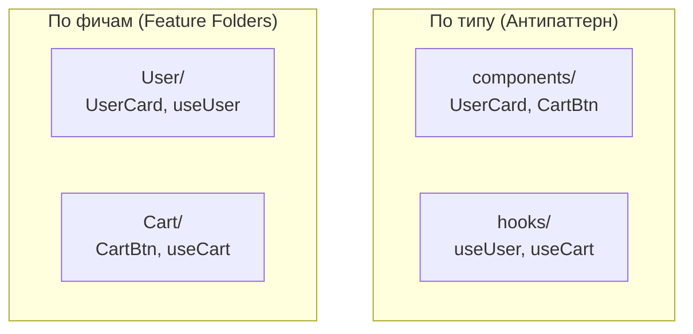

# Feature Folders (Папки по фичам)

## Суть: Группировка по домену
Feature Folders — это прародитель таких методологий, как Feature Sliced Design и Bulletproof React. Главная идея: код нужно группировать не по технической роли (компоненты, хуки, утилиты), а по **бизнес-функционалу** (пользователи, заказы, аналитика).

Мы решаем боль "поиска по проекту". Когда продакт-менеджер просит изменить логику корзины, разработчик должен открыть одну папку `Cart`, а не скакать по всему дереву файлов.

## Как это работает на практике
Каждая фича — это мини-приложение внутри вашего большого приложения. 



## Примеры кода

**Структура Feature Folders:**
```text
src/
  features/
    Payment/
      components/
        PaymentForm.tsx
      hooks/
        useStripe.ts
      api.ts
      utils.ts
    UserProfile/
      ...
```

## Неочевидные нюансы
- **Отсутствие строгих правил:** В отличие от FSD, классический подход Feature Folders не говорит, как фичи должны общаться между собой. В итоге фича `Cart` начинает импортировать фичу `User`, возникает циклическая зависимость и сильная связность (Coupling).
- **Общий код:** Всегда будет код, который не относится ни к одной фиче (UI-кит, базовая настройка axios). Для него всё равно придётся создавать папку `shared` или `common`.
- **Эволюция:** Feature Folders — отличный старт для проекта. Когда проект вырастает и в фичах начинается хаос, команда обычно переходит на FSD.
