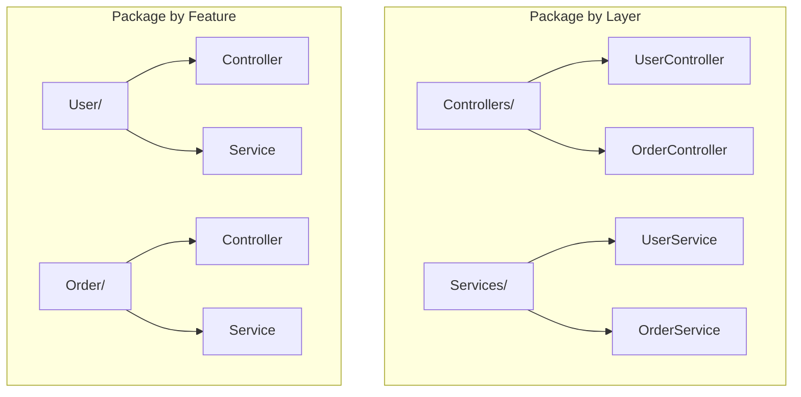

# Package by Feature vs Package by Layer

## Суть: Битва двух подходов
Этот концепт пришел во Frontend из классической Backend-разработки (Java, C#). Он описывает два принципиально разных способа организации пакетов (или папок в корне `src`).

1. **Package by Layer (По слоям):** Группировка по технической абстракции. (Папки: Контроллеры, Сервисы, Репозитории / во Frontend: Компоненты, Хуки, API).
2. **Package by Feature (По фичам):** Группировка по бизнес-сущностям. (Папки: Пользователи, Заказы, Каталог).

Мы решаем боль "кричащей архитектуры" (Screaming Architecture). Открыв папку проекта, вы должны видеть, что делает это приложение (домен), а не какой фреймворк оно использует.

## Как это работает на практике
Package by Layer хорош для микро-проектов. Но как только файлов становится больше 50, Package by Feature побеждает за счет высокой связности (Cohesion) внутри бизнес-домена.



## Примеры (Frontend)

**Package by Layer:**
```text
src/
  components/
    UserList.tsx
    OrderList.tsx
  api/
    userApi.ts
    orderApi.ts
```

**Package by Feature:**
```text
src/
  users/
    UserList.tsx
    api.ts
  orders/
    OrderList.tsx
    api.ts
```

## Неочевидные нюансы
- **Микросервисы и Микрофронтенды:** Архитектура `Package by Feature` позволяет легко "отпилить" фичу и вынести её в отдельный микрофронтенд или микросервис, потому что вся логика фичи инкапсулирована в одной папке. При слоистой архитектуре это сделать невероятно сложно.
- **Компромисс (Гибрид):** Большинство современных методологий (включая FSD) используют гибридный подход: на самом верхнем уровне мы используем Layers, а внутри них дробим код по Features.
