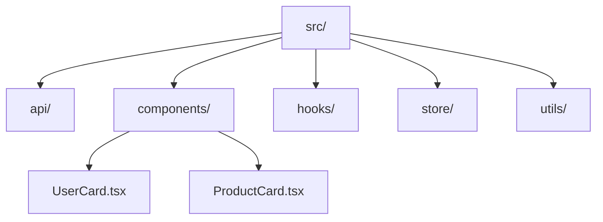

# Package by Layer (Группировка по слоям)

## Суть: Техническая абстракция
`Package by Layer` (или группировка по типу файлов) — это самая популярная архитектура в мире Frontend. Именно её вы получаете из коробки, когда создаёте проект через `create-react-app` или `Vite`. Суть в том, что файлы группируются по их **технической роли**, а не по бизнес-смыслу.

Мы решаем боль "с чего начать". Это отличный старт для небольших проектов, лендингов или MVP, где бизнес-логики почти нет.

## Как это работает на практике
Все React-компоненты лежат в одной папке, все хуки — в другой, все API-запросы — в третьей.



## Примеры кода

**Типичная структура:**
```text
src/
  api/
    user.ts
    cart.ts
  components/
    UserAvatar.tsx
    CartButton.tsx
  hooks/
    useUser.ts
    useCart.ts
```

## Неочевидные нюансы (Почему это ломается)
- **Низкая сплоченность (Low Cohesion):** Код, который изменяется вместе (например, всё для "Корзины"), лежит в 4 разных папках. Чтобы добавить новое поле в корзину, вам нужно открыть `api/cart.ts`, `store/cart.ts`, `hooks/useCart.ts` и `components/CartButton.tsx`.
- **Высокая связность (High Coupling):** Ничто не мешает `useUser.ts` импортировать `cart.ts`. Со временем всё начинает зависеть от всего, образуя спагетти-код.
- **Масштабируемость:** Когда в папке `components` становится 200 файлов, навигация по проекту превращается в ад.
