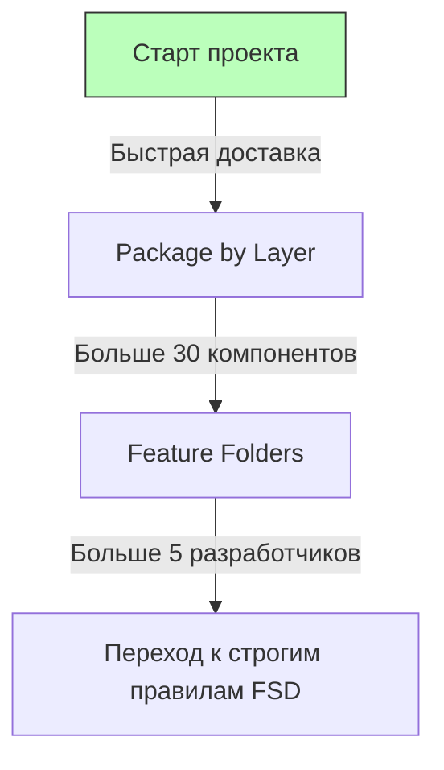

# Pragmatic Architecture (Прагматичная архитектура)

## Суть: Здравый смысл важнее догм
"Прагматичная архитектура" — это не конкретный свод правил, а философия (популяризированная, например, Дэном Абрамовым). Она гласит: **любая абстракция имеет цену**. Не нужно тащить в проект FSD, Clean Architecture или Hexagonal Architecture, если вы делаете простую админку на 5 экранов.

Мы решаем боль архитектурного оверхеда (Overengineering). Разработчики часто тратят часы на обсуждение "куда положить этот файл?", хотя могли бы просто написать код и принести пользу бизнесу.

## Как это работает на практике
Обычно это гибрид. Проект начинается как хаос (Package by Layer). Когда фича разрастается, её выносят в отдельную папку (Feature Folders). Когда появляется много общего кода — создается папка `shared`. 



## Примеры кода

**Прагматичная эволюция структуры:**
```text
// Этап 1: Всё в куче
src/components/UserList.tsx

// Этап 2: Фича выросла, выносим в папку с колокацией
src/components/UserList/
  UserList.tsx
  UserList.module.css
  useUsers.ts

// Этап 3: Фича стала гигантской, выносим в features/
src/features/Users/
```

## Неочевидные нюансы
- **Bus Factor (Фактор автобуса):** Прагматичная архитектура полностью держится на опыте Техлида. Без строгой документации каждый новый разработчик будет приносить свои привычки, и проект быстро превратится в свалку.
- **Технический долг:** Вы осознанно берете техдолг на старте ради скорости. Главное — не пропустить момент (точка бифуркации), когда техдолг начнет тормозить разработку, и вовремя провести рефакторинг.
