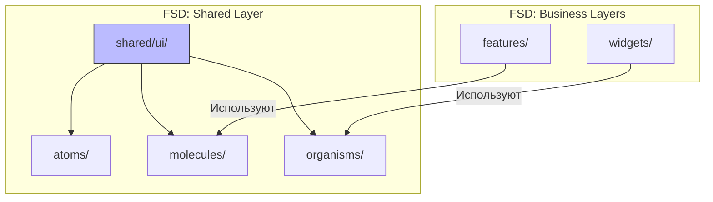

# Сравнение: FSD против Atomic Design

## Суть: Это не конкуренты
Частая ошибка при выборе архитектуры — пытаться сравнить Feature Sliced Design и Atomic Design и выбрать что-то одно. На самом деле, они решают совершенно разные задачи и **могут работать вместе**.

- **Atomic Design** управляет *визуальной композицией*. Он отвечает на вопрос: "Как из кнопок и инпутов собрать красивую карточку?".
- **Feature Sliced Design** управляет *бизнес-композицией*. Он отвечает на вопрос: "Как сделать так, чтобы карточка товара не сломала профиль пользователя?".

## Как это работает на практике
Atomic Design идеально вписывается в слой `shared/ui` методологии FSD.



## Примеры интеграции

**Структура проекта (FSD + Atomic Design):**
```text
src/
  features/
    AuthForm/ (Бизнес-логика)
  shared/
    ui/
      atoms/
        Button.tsx
        Input.tsx
      molecules/
        FormField.tsx (Глупая форма без бизнес-логики)
```

## Неочевидные нюансы
- **Двойной оверхед:** Использовать обе методологии сразу — это огромное испытание для команды. Вам придется спорить не только о том, "Фича это или Сущность?", но и о том, "Молекула это или Организм?".
- **Смерть организмов:** В симбиозе FSD и Atomic Design папка `organisms` часто пустует или удаляется, так как её роль забирают на себя слои `Widgets` и `Features` из FSD. Большинство команд оставляет только `atoms` и `molecules` внутри `shared/ui`.
