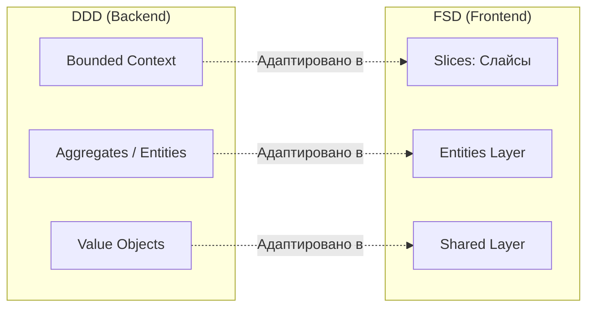

# Сравнение: FSD против Domain-Driven Design (DDD)

## Суть: Frontend — это не Backend
Domain-Driven Design (Предметно-ориентированное проектирование) — это тяжеловесная методология для бэкенда, созданная Эриком Эвансом для управления очень сложной бизнес-логикой. 

FSD во многом **вдохновлён** идеями DDD, но адаптирован под реалии Frontend-разработки (где главное — это UI и взаимодействие с пользователем, а не сложные транзакции и базы данных).

## Как это работает на практике
FSD берет термины из DDD и дает им фронтендерский смысл.

## Главные отличия

1. **Сущности (Entities):** 
   - В DDD Сущность — это умный объект, содержащий кучу бизнес-правил (например, "Нельзя добавить товар в заказ, если он отменен").
   - В FSD Сущность — это "тупой" слой, содержащий типы данных от API и базовый UI-компонент (карточку) без активных действий. Действия вынесены в слой `Features`.
2. **Слои (Layers):**
   - DDD использует слои Application, Domain, Infrastructure.
   - FSD использует слои, специфичные для интерфейсов: Pages, Widgets, Features.

## Неочевидные нюансы
- **DDD на Frontend (Clean Architecture):** Некоторые пытаются тащить чистый DDD на фронтенд (создают Репозитории, UseCases, DTO, Мапперы). В 90% случаев это приводит к катастрофическому оверхеду (создание 10 файлов для того, чтобы просто отправить GET-запрос).
- **FSD — это прагматичный компромисс:** FSD дает вам границы контекстов (Slices), как в DDD, но не заставляет писать тонны бойлерплейта для маппинга данных.
