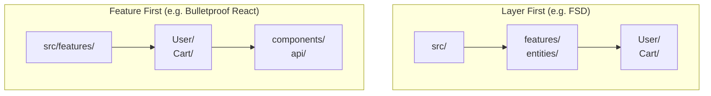

# Layer First против Feature First

## Суть: Главный архитектурный выбор
При проектировании структуры папок мы всегда сталкиваемся с дилеммой: по какой оси делить код на самом верхнем уровне?

- **Layer First (Сначала слои):** Корневые папки — это технические абстракции. Например, `components/`, `api/`, `store/`. А уже внутри них мы делим по фичам (`components/User`, `api/User`).
- **Feature First (Сначала фичи):** Корневые папки — это бизнес-домены. Например, `User/`, `Cart/`. А уже внутри них мы делим по слоям (`User/components`, `User/api`).

Мы решаем боль масштабирования. От этого выбора зависит, как легко будет поддерживать проект через 3 года.

## Как это работает на практике
Интересно, что Feature Sliced Design (FSD) — это **Layer First** подход. На самом верхнем уровне у нас лежат слои (`app`, `pages`, `features`, `entities`), а бизнес-слайсы (Feature First) начинаются только на втором уровне.

## Примеры сравнения

**Layer First (Слои на первом месте):**
Легче контролировать архитектурные зависимости. Если разработчик хочет нарушить правило (импортировать фичу в сущность), он физически выходит из папки `entities/` и идёт в `features/`. Это легко поймать линтером.

**Feature First (Фичи на первом месте):**
Легче удалять и переиспользовать код. Чтобы удалить фичу "Поиск", вам нужно удалить ровно одну папку `src/features/Search`. При Layer First вам придется удалять `features/Search`, `entities/Search` и т.д.

## Неочевидные нюансы
- **Микрофронтенды:** Feature First идеально ложится на микросервисную архитектуру. Каждая папка — потенциальный отдельный репозиторий.
- **Компромисс FSD:** FSD выбрал Layer First на верхнем уровне, потому что во Frontend строгая иерархия визуальных компонентов важнее, чем полная физическая изоляция бизнес-модулей.
