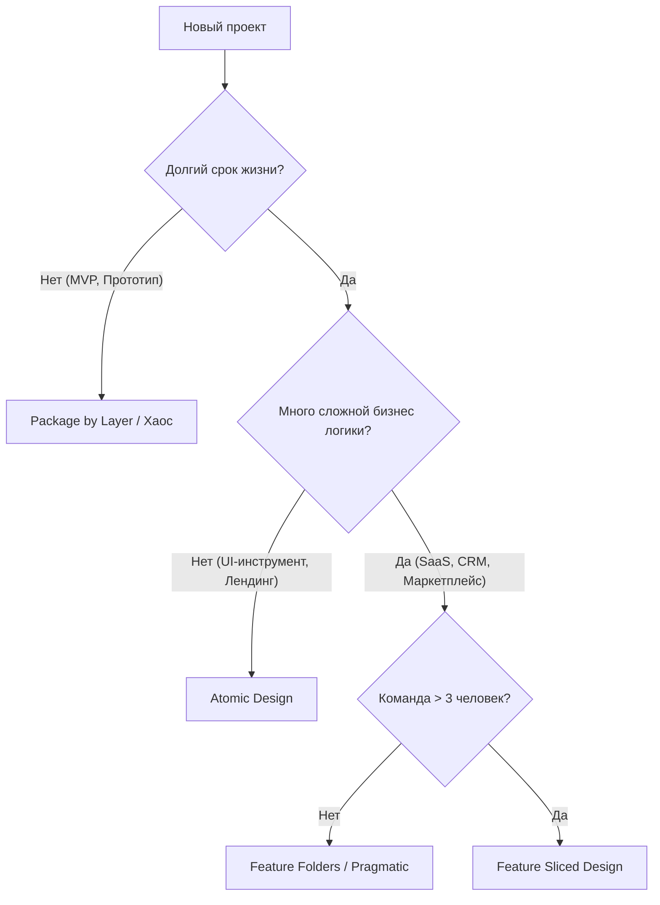

# Выбор структуры проекта

## Суть: Нет серебряной пули
Ни одна архитектура не идеальна для всех проектов. Выбор зависит от трех факторов: 
1. Планируемый срок жизни продукта.
2. Размер команды.
3. Сложность бизнес-логики.

Мы решаем боль "преждевременной оптимизации" (Overengineering). Настраивать FSD для лендинга — это пустая трата денег клиента. Писать Enterprise CRM без архитектуры — это гарантированный провал через год.

## Как это работает на практике
Используйте матрицу принятия решений или дерево вопросов, чтобы понять, что нужно проекту прямо сейчас.

## Рекомендации

### 1. Простые проекты (MVP, Промо-сайты)
- **Выбор:** Package by Layer (Обычная структура `components`, `hooks`, `utils`).
- **Почему:** Максимальная скорость старта. Никакого времени на изучение правил.

### 2. UI-библиотеки и Дизайн-системы
- **Выбор:** Atomic Design.
- **Почему:** Идеальная классификация визуальных компонентов по степени сложности (от простых кнопок до сложных карточек).

### 3. Проекты средней сложности (Стартапы)
- **Выбор:** Feature Folders / Bulletproof React.
- **Почему:** Код уже сгруппирован по смыслу, но разработчикам не нужно тратить часы на споры о том, "что есть сущность, а что фича".

### 4. Enterprise (Долгий срок, большая команда)
- **Выбор:** Feature Sliced Design.
- **Почему:** Строгие контракты. Когда проект огромный, онбординг новых людей упрощается, потому что каждый знает, где должен лежать конкретный файл и куда направлены зависимости.

## Неочевидные нюансы
- **Эволюция важнее старта:** Гораздо важнее заложить возможность безболезненного рефакторинга, чем угадать архитектуру с первого дня. Начинайте просто, усложняйте по мере возникновения реальной боли.
