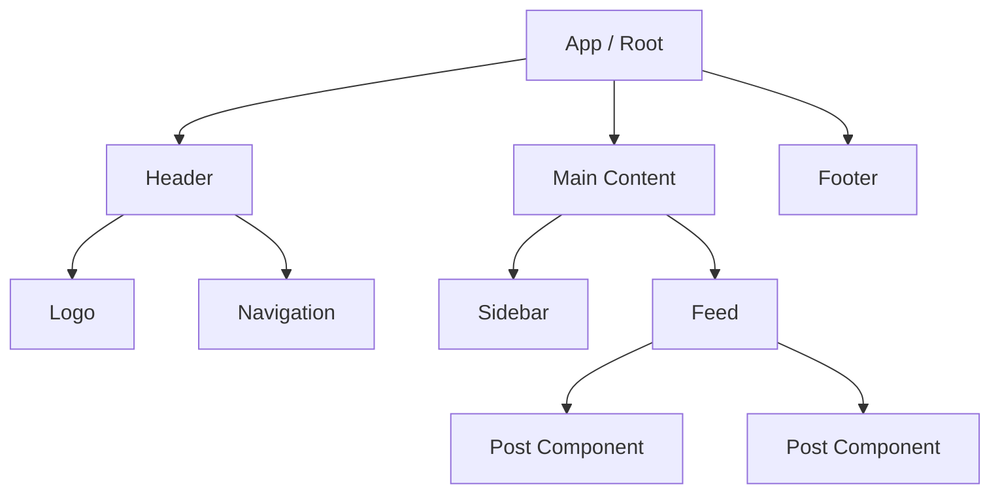

# Компонентная архитектура

Компонентная архитектура — это фундамент разработки современных пользовательских интерфейсов. Она предполагает разбиение монолитного и хрупкого UI на независимые, изолированные и переиспользуемые строительные блоки — **компоненты**.

## Какую боль мы решаем?
В эпоху jQuery и "лапшичного" DOM-кода, любое изменение интерфейса (например, добавление нового класса или обработчика) могло сломать логику в совершенно непредсказуемых местах. Приложение представляло собой глобальное мутабельное состояние. Компонентный подход решает проблему **изоляции** и **масштабируемости**: каждый компонент инкапсулирует свой внешний вид (разметку/стили) и поведение (логику/стейт). 

## Как это работает?
Вместо того чтобы строить страницу целиком, вы собираете её из "кирпичиков".



Каждый компонент должен следовать принципу единой ответственности: он делает только одну вещь, но делает её хорошо. Если компонент разрастается, он дробится на более мелкие.

### Наглядный пример

**Антипаттерн (Монолит):**
Один огромный файл или функция, которая рендерит всю страницу вместе с запросами к API и сложной бизнес-логикой.

**Правильное решение (Композиция компонентов):**
```tsx
const Dashboard = () => {
  return (
    <Layout>
      <Sidebar />
      <MainArea>
        <UserProfile />
        <StatisticsWidget />
      </MainArea>
    </Layout>
  );
};
```

## Неочевидные нюансы и границы применимости
* **Оверхед на абстракцию:** Слишком мелкое дробление ("атомарный дизайн ради атомарного дизайна") приводит к тому, что для понимания работы одной кнопки вам нужно пропрыгать через 10 слоев абстракции.
* **Связность (Coupling):** Если компоненты знают слишком много друг о друге (например, ожидают специфичные пропсы, которые есть только в одном месте приложения), они перестают быть переиспользуемыми.
* **Проблема состояния:** В строго иерархичной структуре обмен данными между соседними ветвями дерева (siblings) становится головной болью, что приводит к появлению стейт-менеджеров и Context API.
