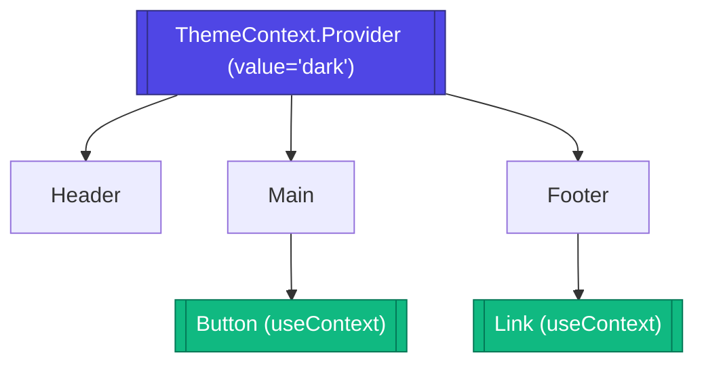

# Context API

**Context API** — это встроенный в React механизм для внедрения зависимостей (Dependency Injection) на уровне компонентов. Он позволяет транслировать данные сквозь всё дерево компонентов, минуя промежуточные узлы.

## Какую боль мы решаем?
Главный враг глубоких компонентных структур — **Props Drilling** (бурение пропсов). Когда вам нужно передать тему оформления, данные авторизованного пользователя или локаль из корневого компонента в кнопку, находящуюся на 10 уровней ниже, вам приходится прокидывать этот пропс через все 9 промежуточных компонентов, которым эти данные абсолютно не нужны. Контекст создает "телепорт" для данных.

## Как это работает?
Создается `Context`, который предоставляет компонент-провайдер (`Provider`). Любой компонент внутри дерева этого провайдера может подписаться на контекст с помощью хука `useContext` (или Consumer) и получить актуальное значение.



### Наглядный пример

**Антипаттерн (Props Drilling):**
```tsx
const App = () => <Layout theme="dark" />;
const Layout = ({ theme }) => <Sidebar theme={theme} />;
const Sidebar = ({ theme }) => <Menu theme={theme} />;
const Menu = ({ theme }) => <Button theme={theme} />; // Только кнопке нужна тема!
```

**Правильное решение (Context):**
```tsx
const ThemeContext = createContext('light');

const App = () => (
  <ThemeContext.Provider value="dark">
    <Layout />
  </ThemeContext.Provider>
);

// Layout, Sidebar, Menu ничего не знают о теме

const Button = () => {
  const theme = useContext(ThemeContext);
  return <button className={`btn-${theme}`}>Click</button>;
};
```

## Неочевидные нюансы (Трейдоффы)
* **Проблема ререндеров:** Это самый большой подводный камень. Когда `value` в `Provider` меняется, **ВСЕ** компоненты, использующие `useContext` для этого контекста, будут перерендерены, даже если им нужна только часть измененных данных.
* **Архитектурный антипаттерн:** Использование React Context как полноценного State Manager'а для часто меняющихся данных (например, ввод текста в форму или координаты мыши) убьет производительность. Контекст идеален для редко меняющихся глобальных настроек (тема, юзер, язык).
* **Слоупок-фикс:** Чтобы избежать лишних ререндеров, огромные объекты состояний часто разбивают на несколько независимых контекстов (например, `ThemeStateContext` и `ThemeDispatchContext`).
