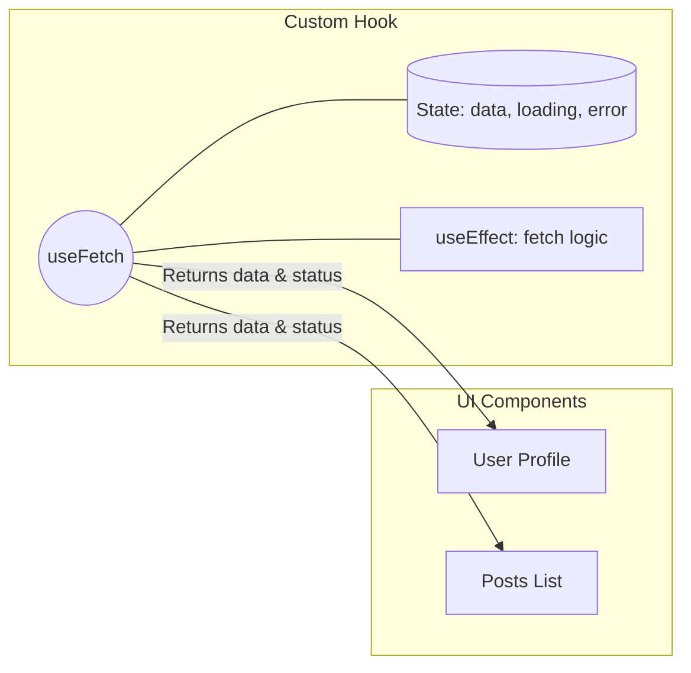

# Custom Hooks

**Custom Hooks (Кастомные хуки)** — это механизм инкапсуляции и переиспользования логики, основанной на состоянии (stateful logic), в React-приложениях. Это обычные JavaScript-функции, название которых начинается с `use`, и которые могут вызывать внутри себя другие хуки.

## Какую боль мы решаем?
До появления хуков (во времена классовых компонентов), чтобы переиспользовать логику (например, подписку на события окна или загрузку данных), приходилось использовать громоздкие паттерны: Higher-Order Components (HOC) или Render Props. Это приводило к "wrapper hell" — бесконечной вложенности обёрток. Кастомные хуки позволяют вынести логику из компонента, сделав сам компонент тонким слоем представления (View), а хук — поставщиком данных и поведения.

## Как это работает?
Вы просто выносите логику с использованием `useState`, `useEffect` и других хуков в отдельную функцию. Компоненты, использующие этот хук, получают изолированное состояние (стейт не шарится между вызовами хука).



### Наглядный пример

**Антипаттерн (Логика в компоненте):**
```tsx
const WindowWidthIndicator = () => {
  const [width, setWidth] = useState(window.innerWidth);
  
  useEffect(() => {
    const handleResize = () => setWidth(window.innerWidth);
    window.addEventListener('resize', handleResize);
    return () => window.removeEventListener('resize', handleResize);
  }, []);

  return <div>Window width is: {width}</div>;
};
```

**Правильное решение (Кастомный хук):**
```tsx
// 1. Вынесли логику
const useWindowWidth = () => {
  const [width, setWidth] = useState(window.innerWidth);
  useEffect(() => { /* ... логика подписки ... */ }, []);
  return width;
};

// 2. Компонент стал "глупым" и чистым
const WindowWidthIndicator = () => {
  const width = useWindowWidth();
  return <div>Window width is: {width}</div>;
};
```

## Неочевидные нюансы и границы применимости
* **Правила Хуков:** Кастомные хуки подчиняются тем же правилам — их нельзя вызывать внутри циклов, условий или вложенных функций. Только на верхнем уровне компонента.
* **Утечки ререндеров:** Если ваш хук возвращает новые объекты или массивы на каждый рендер, а компонент передает их как зависимости в другие хуки (`useEffect`) или дочерние компоненты (`React.memo`), вы получите бесконечные ререндеры. Возвращаемые значения нужно мемоизировать (`useMemo`, `useCallback`).
* **Не глобальный стейт:** Вызов `useWindowWidth` в двух разных компонентах создаст **два независимых** стейта и две подписки. Если нужен единый источник истины, хук нужно комбинировать с Context API или внешним стейт-менеджером.
