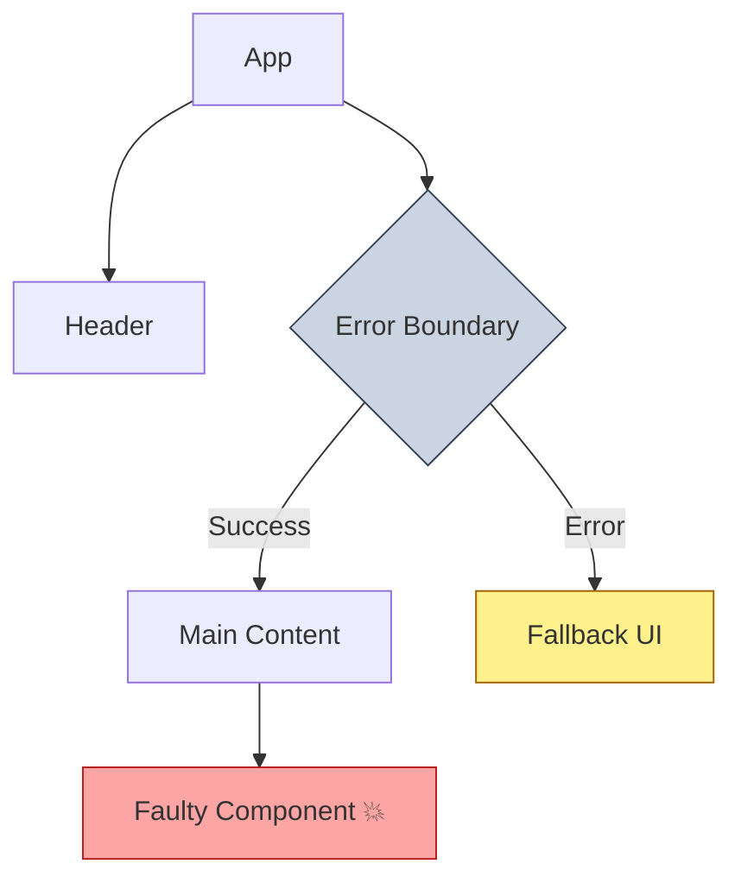

# Error Boundaries

**Error Boundaries (Предохранители / Границы ошибок)** — это React-компоненты, которые перехватывают JavaScript-ошибки в любом месте своего дочернего дерева компонентов, логируют их и отображают запасной (fallback) пользовательский интерфейс вместо сломанного дерева компонентов.

## Какую боль мы решаем?
До появления Error Boundaries (в React 16), любая необработанная ошибка в методе рендера или хуках дочернего компонента приводила к "размонтированию" (unmount) всего приложения. Пользователь видел просто белый экран смерти (White Screen of Death). Это недопустимо для Production-приложений. Error Boundaries локализуют аварию, позволяя остальной части интерфейса (например, сайдбару или навигации) продолжать работать.

## Как это работает?
В React концепция Error Boundary до сих пор (на момент написания) реализуется **только через классовые компоненты** (методы `static getDerivedStateFromError()` и `componentDidCatch()`). Хотя существуют библиотеки (например, `react-error-boundary`), которые оборачивают это в удобные компоненты или хуки.



### Наглядный пример

**Правильное решение (Использование границы):**
```tsx
import { ErrorBoundary } from 'react-error-boundary';

function Fallback({ error, resetErrorBoundary }) {
  return (
    <div role="alert">
      <p>Что-то пошло не так:</p>
      <pre>{error.message}</pre>
      <button onClick={resetErrorBoundary}>Попробовать снова</button>
    </div>
  );
}

const Dashboard = () => {
  return (
    <ErrorBoundary FallbackComponent={Fallback} onReset={() => resetData()}>
      <WidgetThatMightFail />
    </ErrorBoundary>
  );
};
```

## Неочевидные нюансы и границы применимости
* **Где они НЕ работают:** Error Boundaries перехватывают ошибки только в фазе рендеринга, методах жизненного цикла и конструкторах дочерних элементов. Они **не поймают** ошибки в:
  1. Обработчиках событий (например, `onClick` — там нужен обычный `try/catch`).
  2. Асинхронном коде (например, в `setTimeout` или `fetch` промисах).
  3. Server Side Rendering (SSR).
  4. Ошибки в самом компоненте Error Boundary.
* **Гранулярность:** Оборачивать всё приложение в один Error Boundary — плохая практика (если упадет один виджет, пользователь увидит заглушку на всю страницу). Лучше оборачивать независимые смысловые блоки (виджеты, секции) по отдельности.
* **Восстановление:** Всегда предоставляйте пользователю возможность восстановить работу (кнопка "Retry" или сброс стейта, вызвавшего ошибку), иначе вы просто замените белый экран на красивую, но бесполезную заглушку.
