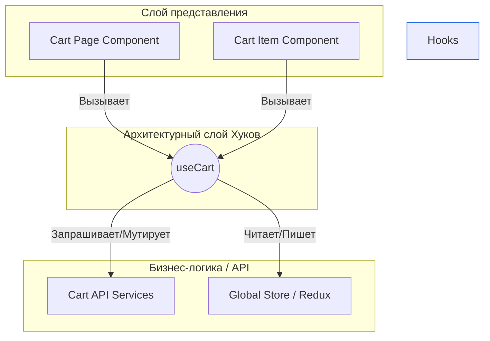

# Hooks как архитектурный слой

**Хуки как архитектурный слой** — это подход, при котором кастомные хуки выступают в роли полноценной прослойки (Service Layer или ViewModel) между пользовательским интерфейсом (View) и источниками данных или бизнес-логикой (Model/API).

## Какую боль мы решаем?
Без выделения логики в хуки, разработчики часто создают "Божественные компоненты" (God Components). В одном файле на 1000 строк смешиваются верстка, стейт-менеджмент, валидация форм, запросы к серверу и маппинг данных. Такой компонент невозможно ни прочитать, ни протестировать, ни переиспользовать. Хуки позволяют вынести всю "не-UI" логику за пределы компонента.

## Как это работает?
Вы проектируете приложение по слоям. Компонент отвечает **только** за рендер данных (JSX) и привязку обработчиков событий. Всю тяжелую работу делает хук, к которому обращается компонент.



### Наглядный пример

**Антипаттерн (Толстый компонент):**
```tsx
const UserProfile = ({ userId }) => {
  const [user, setUser] = useState(null);
  const [loading, setLoading] = useState(true);

  useEffect(() => {
    fetch(`/api/users/${userId}`)
      .then(res => res.json())
      .then(data => {
        // Какая-то бизнес логика: фильтрация и маппинг
        setUser(data.map(...)); 
        setLoading(false);
      });
  }, [userId]);

  if (loading) return <Spinner />;
  return <div>{user.name}</div>; // JSX
};
```

**Правильное решение (Хук как слой):**
```tsx
// 1. Слой логики (ViewModel)
const useUserProfile = (userId) => {
  const { data, isLoading } = useQuery(['user', userId], () => fetchUser(userId));
  
  // Бизнес-логика инкапсулирована здесь
  const formattedUser = formatUserData(data); 

  return { user: formattedUser, loading: isLoading };
};

// 2. Слой View (Тонкий и глупый компонент)
const UserProfile = ({ userId }) => {
  const { user, loading } = useUserProfile(userId);

  if (loading) return <Spinner />;
  return <div>{user.name}</div>;
};
```

## Неочевидные нюансы и границы применимости
* **Привязка к экосистеме:** Бизнес-логика, написанная внутри кастомного хука, намертво привязывается к React. Если завтра вы захотите перенести логику в Vue или Vanilla JS, вам придется переписывать всё. Для чистой (Domain) логики лучше использовать обычные TS/JS классы или функции, а хук использовать лишь как "клей" между React и этой логикой.
* **Тестирование:** Тестировать хуки сложнее, чем чистые функции. Потребуется специфичный инструментарий вроде `@testing-library/react-hooks`, так как хук не может существовать вне контекста рендеринга компонента.
* **Over-engineering:** Для тривиальных компонентов выносить `useState` в отдельный `useButtonToggle` — это избыточное усложнение. Применяйте паттерн там, где логика действительно начинает мешать чтению разметки.
