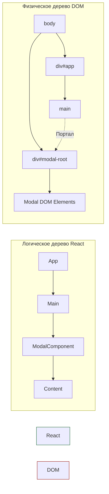

# Portals (Порталы)

**Portals (Порталы)** — это механизм React, который позволяет отрендерить дочерние элементы в DOM-узел, находящийся физически вне DOM-иерархии родительского компонента.

## Какую боль мы решаем?
Когда вы пытаетесь создать всплывающее окно (модалку), тултип или выпадающий список (dropdown) глубоко внутри дерева компонентов, вы неминуемо столкнетесь с проблемами CSS-контекста наложения (`z-index` wars) и обрезкой контента (`overflow: hidden`). Если родительский контейнер имеет `overflow: hidden`, ваша красивая модалка будет безжалостно обрезана по краям этого контейнера. Порталы позволяют "выбросить" HTML модалки прямо в `<body>`, избежав этих ограничений.

## Как это работает?
React предоставляет метод `createPortal(child, container)`. Он говорит: "Сохрани этот элемент логически в текущем React-дереве, но физически вставь его в указанный `container` (например, в `<div id="modal-root"></div>` в конце `<body>`)".



### Наглядный пример

**Антипаттерн (Модалка рендерится по месту):**
```tsx
const OverflowContainer = () => (
  <div style={{ overflow: 'hidden', height: '100px' }}>
    <button>Open Modal</button>
    {/* Модалка будет обрезана! */}
    <div className="absolute top-0 w-full h-screen">I am a modal</div> 
  </div>
);
```

**Правильное решение (Использование Portal):**
```tsx
import { createPortal } from 'react-dom';

const Modal = ({ children }) => {
  // Рендерим разметку в элемент вне потока
  return createPortal(
    <div className="fixed inset-0 bg-black/50">
      <div className="bg-white p-4">{children}</div>
    </div>,
    document.getElementById('modal-root') // Заранее подготовленный div в index.html
  );
};
```

## Неочевидные нюансы и границы применимости
* **Всплытие событий (Event Bubbling):** Это самая важная и неочевидная деталь. Хотя физически в DOM элемент портала находится в другом месте (в `modal-root`), для системы событий React он всё ещё находится внутри дерева React. Если вы кликнете по кнопке внутри портала, событие `onClick` всплывёт к компоненту-родителю портала в React-дереве! Это может привести к неожиданным багам, если родитель слушает `onClick`.
* **Доступность (a11y):** Вынося контент в портал, вам нужно самостоятельно заботиться о фокусе (focus trap). Иначе пользователь, нажимая `Tab`, сможет выйти за пределы визуально открытой модалки и начать взаимодействовать со страницей под ней.
* **Оверхед:** Не нужно использовать порталы для всего подряд. Применяйте их только там, где есть реальная необходимость "вырваться" из текущего DOM-контекста (overlay элементы).
