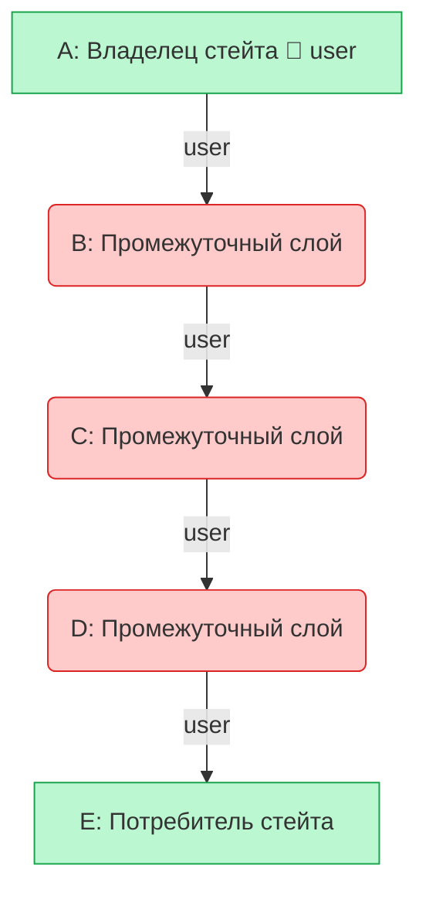

# Props Drilling (Бурение пропсов)

**Props Drilling** — это процесс передачи данных (props) из родительского компонента глубоко вниз по дереву компонентов через промежуточные слои, которым эти данные абсолютно не нужны для их собственной работы.

## Какую боль мы решаем?
Это скорее описание "боли", а не её решение. Когда архитектура компонентов становится глубокой, передача данных превращается в логистический кошмар. Промежуточные компоненты загрязняются свойствами, которые они только транслируют дальше. При изменении имени или типа такого свойства приходится рефакторить весь стек промежуточных слоев.

## Как это работает?
Данные текут строго сверху вниз (one-way data flow). Если узлу `E` нужны данные из узла `A`, то узлы `B`, `C` и `D` вынуждены работать курьерами.



### Наглядный пример

**Антипаттерн (Props Drilling):**
```tsx
const App = ({ user }) => <Page user={user} />;
// Page ничего не делает с user, кроме передачи дальше
const Page = ({ user }) => <Layout user={user} />;
// Layout тоже просто передает
const Layout = ({ user }) => <Sidebar user={user} />;
// И только тут мы используем имя!
const Sidebar = ({ user }) => <UserProfile name={user.name} />;
```

**Правильное решение 1 (Композиция / Inversion of Control):**
Вместо того чтобы прокидывать данные, мы собираем UI наверху и прокидываем готовые компоненты (через `children` или слоты).
```tsx
const App = ({ user }) => (
  <Page>
    <Layout>
      {/* Мы передаем готовый профиль вниз! */}
      <Sidebar profile={<UserProfile name={user.name} />} />
    </Layout>
  </Page>
);

// Промежуточные слои стали чистыми, они знают только о `children`
const Page = ({ children }) => <div>{children}</div>;
const Layout = ({ children }) => <div className="flex">{children}</div>;
const Sidebar = ({ profile }) => <aside>{profile}</aside>;
```

**Правильное решение 2 (Context API / State Manager):**
Если данные нужны вообще везде (тема, текущий юзер), используется Context API.

## Неочевидные нюансы и границы применимости
* **Drilling — это не всегда зло:** Передача пропсов на 1-2 уровня вглубь — это абсолютно нормальная, здоровая и самая явная архитектура. Вы сразу видите, откуда пришли данные. Избегание ЛЮБОГО дриллинга и преждевременное засовывание всего в Context делает архитектуру запутанной (спагетти из контекстов).
* **Скрытая связность:** Использование контекста скрывает зависимости компонента. Функция перестает быть "чистой" — её поведение начинает зависеть от окружения (наличия провайдера выше по дереву). Drilling же сохраняет контракт компонента строгим и явным.
* **Золотое правило:** Если пропсы нужно прокинуть через более чем 3-4 слоя компонентов, которые никак не используют эти пропсы концептуально, пора использовать композицию (children) или Контекст.
