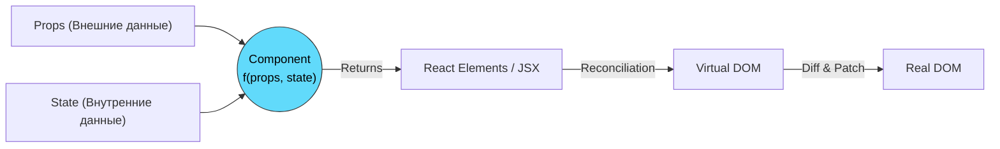

# React Component Model (Компонентная модель React)

**React Component Model** — это фундаментальная парадигма, лежащая в основе React, которая утверждает, что пользовательский интерфейс — это предсказуемый результат выполнения функции (компонента), на вход которой подается текущее состояние приложения.

## Какую боль мы решаем?
До React доминировал **императивный подход** работы с DOM. Вы вручную искали элементы (`getElementById`), вручную меняли их свойства и вручную следили за тем, чтобы интерфейс не рассинхронизировался с данными. При сложной логике (например, многоступенчатые формы) это превращалось в неконтролируемый хаос. Компонентная модель React вводит **декларативный подход**: вы описываете, как UI *должен* выглядеть при определенном состоянии, а React сам разбирается, как эффективно обновить DOM (через Virtual DOM).

## Как это работает?
В основе лежит простая формула: `UI = f(state)`.
Компонент — это функция (`f`). Она принимает входные данные (`props` и `state`) и возвращает описание интерфейса (JSX). Если данные меняются, функция вызывается снова, и UI обновляется.



### Наглядный пример

**Императивный антипаттерн (Vanilla JS):**
```javascript
const btn = document.getElementById('btn');
const text = document.getElementById('text');
let count = 0;

btn.addEventListener('click', () => {
  count++;
  // Ручное императивное обновление UI
  text.innerText = `Счетчик: ${count}`;
  if (count > 5) {
      btn.style.backgroundColor = 'red';
  }
});
```

**Декларативное решение (React Component Model):**
```tsx
const Counter = () => {
  // 1. Описываем состояние
  const [count, setCount] = useState(0);

  // 2. Декларативно описываем ВЕСЬ UI для любого состояния
  return (
    <div>
      <p>Счетчик: {count}</p>
      <button 
        onClick={() => setCount(c => c + 1)}
        style={{ backgroundColor: count > 5 ? 'red' : 'blue' }}
      >
        Кликни
      </button>
    </div>
  );
};
```

## Неочевидные нюансы и границы применимости
* **Однонаправленный поток данных (One-way data flow):** Данные всегда текут сверху вниз — от родителя к потомку через пропсы. Потомок не может напрямую изменить пропсы (они иммутабельны), он может только вызвать callback, переданный родителем, чтобы родитель изменил *свой* стейт и спустил новые пропсы вниз. Это делает приложение предсказуемым.
* **Побочные эффекты (Side Effects):** Формула `UI = f(state)` подразумевает, что функция должна быть чистой (без сайд-эффектов во время рендера). Любое взаимодействие с внешним миром (запросы к API, подписки) должно быть вынесено за пределы фазы рендеринга — в `useEffect` или обработчики событий.
* **Иммутабельность:** React понимает, что состояние изменилось, сравнивая ссылки на объекты (`Object.is`). Если вы мутируете стейт напрямую (`state.count = 1`), React не заметит изменений и не перерендерит компонент. Всегда нужно возвращать новые объекты.
