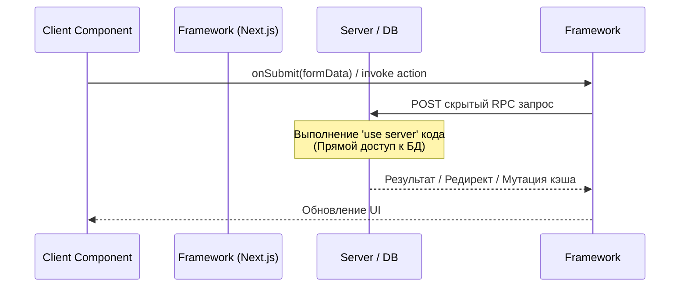

# Server Actions

**Server Actions (Серверные действия)** — это асинхронные функции, которые выполняются исключительно на сервере, но могут быть вызваны напрямую из клиентских компонентов React. Это мост между клиентом и сервером без явного создания API.

## Какую боль мы решаем?
Раньше, чтобы отправить форму или поставить "лайк", вам нужно было:
1. Создать отдельный API endpoint (`/api/like`).
2. В компоненте написать обработчик, который делает `fetch`.
3. Управлять состоянием загрузки (`isLoading`).
4. Обрабатывать ошибки сети.
5. Инвалидировать или обновлять кэш, чтобы UI обновился.

Server Actions позволяют пропустить создание API и работу с сетью, вызывая серверную функцию так, будто она локальная.

## Как это работает?
Вы помечаете функцию директивой `'use server'`. Фреймворк (например, Next.js) под капотом сам создает скрытый RPC (Remote Procedure Call) endpoint. Когда клиентский компонент вызывает эту функцию, React сериализует аргументы, отправляет POST-запрос, сервер выполняет код (например, пишет в БД), и возвращает результат клиенту.



### Наглядный пример

**Антипаттерн (Старый подход с явным API):**
```tsx
// Клиент
const handleSubmit = async (e) => {
  e.preventDefault();
  const res = await fetch('/api/user', { method: 'POST', body: ... });
  // ручная обработка результата
}
```

**Правильное решение (Server Action):**
```tsx
// server-action.js
'use server'
import { db } from '@/db';

export async function updateUser(formData) {
  const name = formData.get('name');
  await db.users.update({ name });
  // Next.js: автоматически обновим страницу
  revalidatePath('/profile'); 
}

// client-component.jsx
import { updateUser } from './server-action';

// React автоматически сделает progressive enhancement формы
export default function Form() {
  return (
    <form action={updateUser}>
      <input name="name" />
      <button type="submit">Save</button>
    </form>
  );
}
```

## Неочевидные нюансы и границы применимости
* **Слепое пятно безопасности:** Server Action — это публичный API-эндпоинт, даже если он не описан в Swagger. Любой может отправить POST-запрос к вашему Action. Если вы забудете проверить авторизацию пользователя *внутри* самой функции `updateUser`, вы получите критическую уязвимость (IDOR).
* **Среда выполнения:** Легко запутаться, где выполняется код. Если вы попытаетесь вызвать `window.alert` внутри Server Action, всё упадет, так как это среда Node.js/Edge.
* **Сложность с комплексным UI:** Server Actions идеальны для простых форм и мутаций данных. Но если вам нужен прогресс-бар загрузки файла, потоковая передача огромных данных или сложная валидация в реальном времени с feedback-ом на каждое нажатие, классический API + клиентский стейт будут надежнее.
