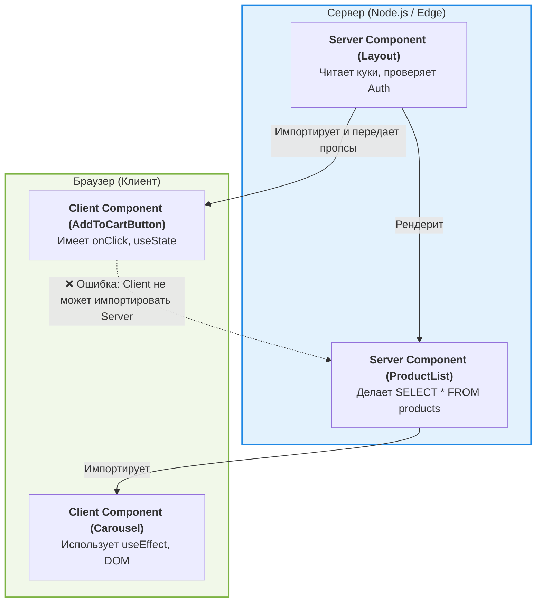

React Server Components (RSC) — это фундаментальный сдвиг в архитектуре React. Они позволяют рендерить компоненты исключительно на сервере, отправляя в браузер только готовый HTML и легковесное описание UI, без отправки JavaScript-кода самого компонента.

## Проблема (Боль)

В классическом Client-Side Rendering (CSR) и даже традиционном Server-Side Rendering (SSR) мы сталкиваемся с двумя главными проблемами:
1. **Водопад запросов (Network Waterfalls):** Компонент рендерится, понимает, что ему нужны данные, делает запрос, ждет. Дочерний компонент делает то же самое. 
2. **Разбухание бандла (Bundle Bloat):** Вся логика рендеринга, а также тяжелые библиотеки (например, форматирование дат `moment.js` или парсинг Markdown), отправляются в браузер, даже если результат их работы статичен.

### Антипаттерн: Классический Fetching на клиенте
```tsx
// ❌ Тяжелый клиентский бандл + водопад запросов
import { useEffect, useState } from 'react';
import sanitizeHtml from 'sanitize-html'; // Эта тяжелая библиотека улетит клиенту!

export function BlogPost({ id }) {
  const [post, setPost] = useState(null);

  useEffect(() => {
    fetch(`/api/posts/${id}`).then(res => res.json()).then(setPost);
  }, [id]);

  if (!post) return <Spinner />;

  return <div dangerouslySetInnerHTML={{ __html: sanitizeHtml(post.content) }} />;
}
```

## Решение: Server Components

Server Components выполняются только один раз во время сборки или по запросу на сервере. Они имеют прямой доступ к базам данных и файловой системе, и их зависимости никогда не попадают в клиентский бандл.

### Как это выглядит (Стиль RSC)
```tsx
// ✅ Серверный компонент (по умолчанию в Next.js App Router)
// Зависимость sanitize-html остается на сервере
import sanitizeHtml from 'sanitize-html';
import { db } from '@/lib/db';

// Компонент может быть async!
export default async function BlogPost({ id }) {
  // Прямой доступ к базе данных
  const post = await db.posts.findById(id); 

  return (
    <article>
      <h1>{post.title}</h1>
      {/* HTML отдается клиенту уже в готовом виде */}
      <div dangerouslySetInnerHTML={{ __html: sanitizeHtml(post.content) }} />
    </article>
  );
}
```

## Архитектура: Интеграция Client и Server

React теперь разделяет компоненты на два типа:
- **Server Components:** Рендерятся на сервере. Могут быть асинхронными. Не имеют доступа к состоянию.
- **Client Components:** Рендерятся на клиенте (и пререндерятся на сервере). Могут использовать хуки (`useState`, `useEffect`). Отмечаются директивой `'use client'`.



## Трейдоффы и границы применимости

### Когда использовать ✅
- **Статический и контентный UI:** Статьи, описания товаров, футеры, навигация.
- **Прямая работа с бэкендом:** Когда нужно безопасно получить данные, не создавая промежуточный API endpoint.
- **Использование тяжелых библиотек:** Генерация PDF, синтаксическая подсветка кода, парсинг markdown.

### Когда НЕ использовать (Нужен Client Component) ❌
- **Интерактивность:** Если вам нужен `onClick`, `onChange`, `onScroll`.
- **Состояние и Жизненный цикл:** Если нужны `useState`, `useReducer`, `useEffect`, `useLayoutEffect`.
- **Browser API:** Использование `window`, `document`, `localStorage`, `geolocation`.

### Неочевидные нюансы
- **Передача данных (Serialization):** Вы не можете передать функцию или класс (не сериализуемые данные) в качестве пропса от Server Component к Client Component. Пропсы должны быть JSON-совместимыми.
- **Дыры в дереве (Holes in the tree):** Client Component не может напрямую импортировать Server Component. Но вы можете передать Server Component как `children` в Client Component! Это позволяет "вставлять" серверный контент внутрь клиентской оболочки.
- **Изменение парадигмы:** RSC стирает границу между бэкендом и фронтендом. Разработчику нужно четко понимать, где выполняется каждая строчка его кода, иначе есть риск случайно слить приватные ключи или секреты в клиентский бандл.
