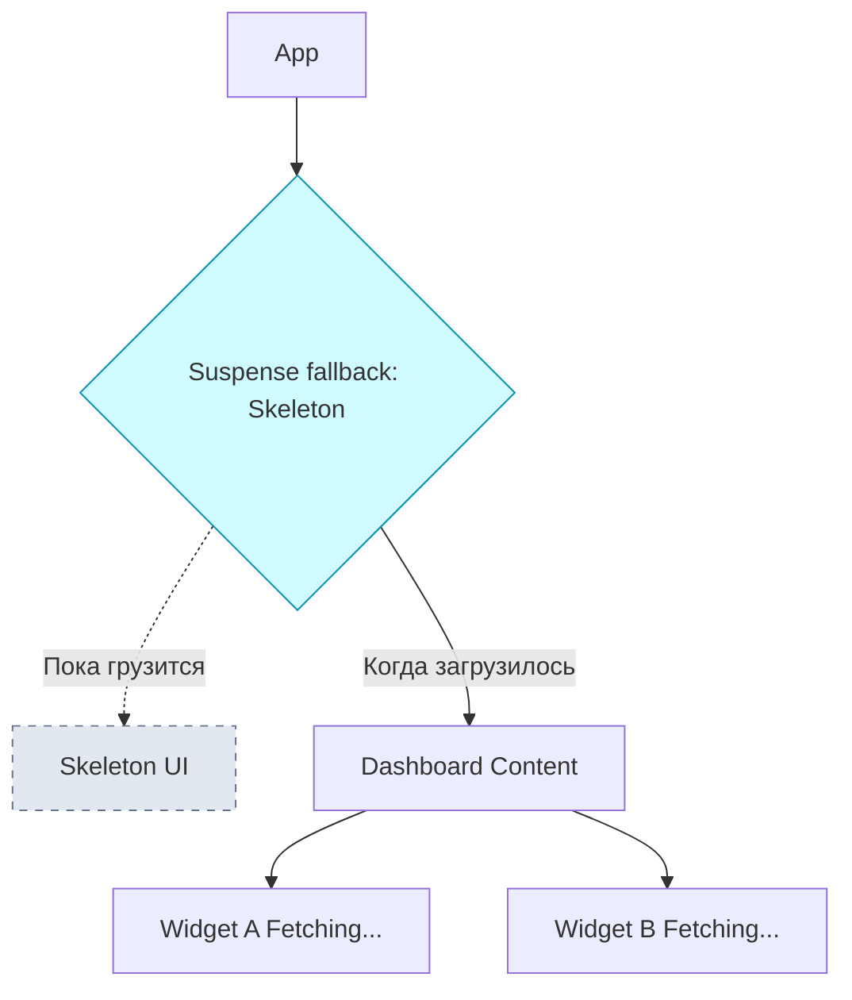

# Suspense Boundaries

**Suspense Boundaries** — это декларативный механизм React для управления состояниями загрузки. Компонент `<Suspense>` позволяет "приостановить" рендеринг части компонентного дерева до тех пор, пока не выполнятся необходимые условия (например, загрузка кода компонента или асинхронных данных), показывая вместо этого запасной (fallback) интерфейс.

## Какую боль мы решаем?
До Suspense обработка загрузок была императивной и локальной. В каждом компоненте приходилось писать `if (isLoading) return <Spinner />;`. 
Если у вас есть дашборд с тремя графиками, каждый из которых загружает свои данные, вы получали "эффект попкорна": спиннеры появлялись и исчезали хаотично, графики прыгали, перестраивая Layout. Suspense позволяет вынести управление загрузкой на уровень выше и координировать рендер (например, дождаться загрузки всех трех графиков, показывая один общий скелетон).

## Как это работает?
Компонент внутри дерева может выбросить (throw) Promise вместо ошибки. `<Suspense>` ловит этот Promise. Пока Promise находится в состоянии `pending`, Suspense рендерит `fallback`. Как только Promise `resolved`, Suspense рендерит дочерние компоненты.



### Наглядный пример

**Антипаттерн (Императивный водопад спиннеров):**
```tsx
const Dashboard = () => {
  return (
    <div>
      {/* Каждый сам за себя. Прыгающий интерфейс */}
      <ProfileWidget /> 
      <FeedWidget />
    </div>
  );
};
```

**Правильное решение (Декларативный Suspense):**
```tsx
import { Suspense } from 'react';

const Dashboard = () => {
  return (
    // Пока Profile или Feed грузят данные (или свой JS код),
    // мы показываем ОДИН красивый скелетон на всю область
    <Suspense fallback={<DashboardSkeleton />}>
      <ProfileWidget />
      <FeedWidget />
    </Suspense>
  );
};
```

## Неочевидные нюансы и границы применимости
* **Не работает с обычным `fetch` "из коробки":** Вы не можете просто написать `fetch` в `useEffect` и ожидать, что Suspense это подхватит. Компонент должен использовать библиотеки, совместимые с Suspense (React Query, SWR, Relay) или работать в парадигме React Server Components (RSC), где можно делать асинхронные компоненты (`async function MyComponent()`).
* **Каскадные загрузки (Waterfalls):** Если не использовать параллельный предзагрузчик (preload), Suspense может создать водопад загрузок. Если `FeedWidget` вложен в `ProfileWidget`, то запрос данных для `Feed` не начнется, пока не загрузится `Profile`.
* **Гранулярность:** Как и с Error Boundaries, оборачивать всё приложение в один Suspense со спиннером в центре экрана — плохой UX. Нужно стратегически расставлять Suspense-границы вокруг смысловых блоков, которые могут загружаться независимо.
