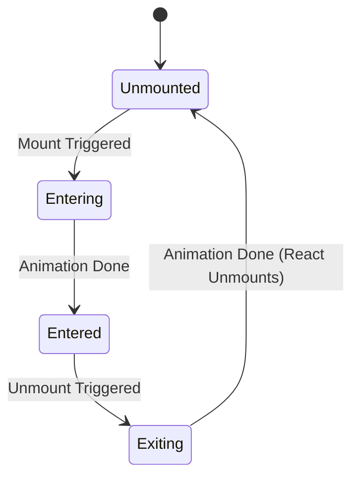

# Animation Architecture (Архитектура анимаций)

**Архитектура анимаций** — это подход к проектированию UI, при котором анимации (вход, выход, переходы между состояниями) не являются "костылями" из CSS сверху, а заложены в фундаментальный жизненный цикл компонента.

## Какую боль мы решаем?
Анимировать появление элемента в React просто (CSS `animation` на монтировании). Главная боль — это **анимация исчезновения (Unmount)**. Если вы поменяете `isOpen` на `false`, React мгновенно удалит DOM-узел. Ваша красивая CSS-анимация `fadeOut` просто не успеет проиграться — элемент исчезнет моментально.

## Как это работает?
Для решения проблемы "мгновенного убийства" узлов требуются специальные архитектурные механизмы: промежуточные состояния или оркестраторы, которые задерживают реальный React Unmount до завершения анимации. Этим занимаются библиотеки вроде `framer-motion` (компонент `AnimatePresence`) или `react-transition-group`.



### Наглядный пример

**Антипаттерн (Мгновенное исчезновение):**
```tsx
const Modal = ({ isOpen }) => {
  // При isOpen === false компонент просто пропадает из DOM
  if (!isOpen) return null; 
  
  // Этот класс отработает только на появление
  return <div className="animate-fade-in">Я модалка!</div>;
};
```

**Правильное решение (Стейт-машина анимаций, framer-motion):**
```tsx
import { motion, AnimatePresence } from "framer-motion";

const ModalContainer = ({ isOpen }) => {
  return (
    // AnimatePresence "держит" компонент в DOM, пока он не проиграет exit-анимацию
    <AnimatePresence>
      {isOpen && (
        <motion.div
          initial={{ opacity: 0 }}
          animate={{ opacity: 1 }}
          exit={{ opacity: 0 }} // Вот магия!
        >
          Я модалка!
        </motion.div>
      )}
    </AnimatePresence>
  );
};
```

## Неочевидные нюансы и границы применимости
* **CSS vs JS Анимации:** Библиотеки вроде `react-spring` или `framer-motion` делают вычисления позиций в JS и применяют инлайн-стили (`transform`, `opacity`) на каждый кадр вне основного цикла рендера React. Это мощно, но для простых `hover` эффектов и простых переходов всегда используйте чистый CSS (`transition`) — это банально быстрее и дешевле для браузера.
* **Перегрузка дерева (Performance):** Компоненты вроде `AnimatePresence` и `<Transition>` добавляют ощутимый оверхед в React Tree. Если у вас список из 1000 строк, оборачивать каждую в сложный анимационный оркестратор — прямой путь к лагам. 
* **Accessibility (a11y):** Всегда уважайте пользовательские настройки. Если в ОС пользователя включено "Уменьшение движения" (`prefers-reduced-motion`), ваша архитектура должна уметь отключать или заменять анимации на мгновенные переходы.
