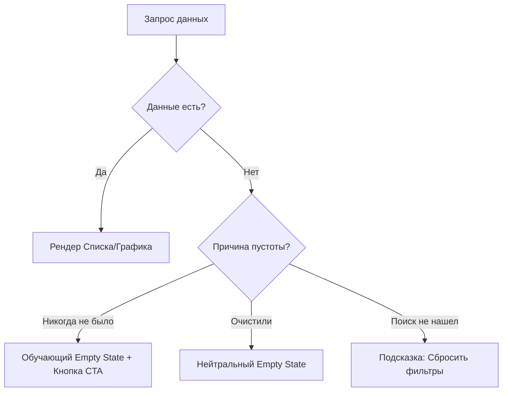

# Empty States (Пустые состояния)

**Empty States** — это специально спроектированные состояния интерфейса, которые отображаются, когда для текущего компонента нет данных. Это моменты, когда корзина пуста, поиск не дал результатов или у пользователя еще нет уведомлений.

## Какую боль мы решаем?
Многие разработчики мыслят "счастливым путем" (happy path) — когда данные есть всегда. Когда данных нет, приложение либо рендерит пустой белый экран (что воспринимается как баг), либо показывает сухую системную заглушку "Массив data пуст", либо ломается, пытаясь вызвать `.map()` на `undefined`. Правильный Empty State превращает тупик интерфейса в точку роста и взаимодействия.

## Как это работает?
Пустое состояние должно давать ответы на 3 вопроса:
1. **Что произошло?** (Поиск не нашел результатов / Корзина пуста).
2. **Почему?** (Вы неправильно ввели слово / Вы еще ничего не добавили).
3. **Что делать дальше?** (Попробуйте другие фильтры / Перейти в каталог товаров).



### Наглядный пример

**Антипаттерн (Тупик):**
```tsx
const Cart = ({ items }) => {
  if (items.length === 0) {
    // Пользователь видит пустой экран или скучный текст. Тупик.
    return <div>Нет товаров.</div>; 
  }

  return <ul>{items.map(i => <li key={i.id}>{i.name}</li>)}</ul>;
};
```

**Правильное решение (Полезный Empty State):**
```tsx
const Cart = ({ items }) => {
  if (items.length === 0) {
    return (
      <div className="flex flex-col items-center justify-center p-8 text-center">
        <EmptyCartIllustration />
        <h3 className="text-xl font-bold mt-4">Ваша корзина скучает</h3>
        <p className="text-gray-500 mt-2">Загляните в каталог, чтобы найти что-то интересное.</p>
        <Link href="/catalog" className="btn-primary mt-6">
          Перейти к покупкам
        </Link>
      </div>
    );
  }

  return <CartList items={items} />;
};
```

## Неочевидные нюансы и границы применимости
* **Подмена понятий:** Empty State — это **не** Error State. Пустой список задач — это нормальное штатное поведение приложения. Ошибка загрузки списка задач — это сбой. Они должны визуально отличаться: Empty state призывает к действию, Error state призывает повторить запрос.
* **Перегрузка дизайна:** Не стоит рисовать огромные иллюстрации на половину экрана для каждой мелочи. Если пуст маленький виджет погоды в углу экрана, достаточно простого текста "Нет данных по локации". Большие иллюстрации уместны для полноэкранных состояний.
* **Сброс фильтров:** Самая частая ошибка в поисковых Empty States — забыть дать пользователю кнопку "Сбросить фильтры". Пользователь может забыть, что он включил фильтр "Красные слоны 1980 года", и думать, что товаров нет вообще.
