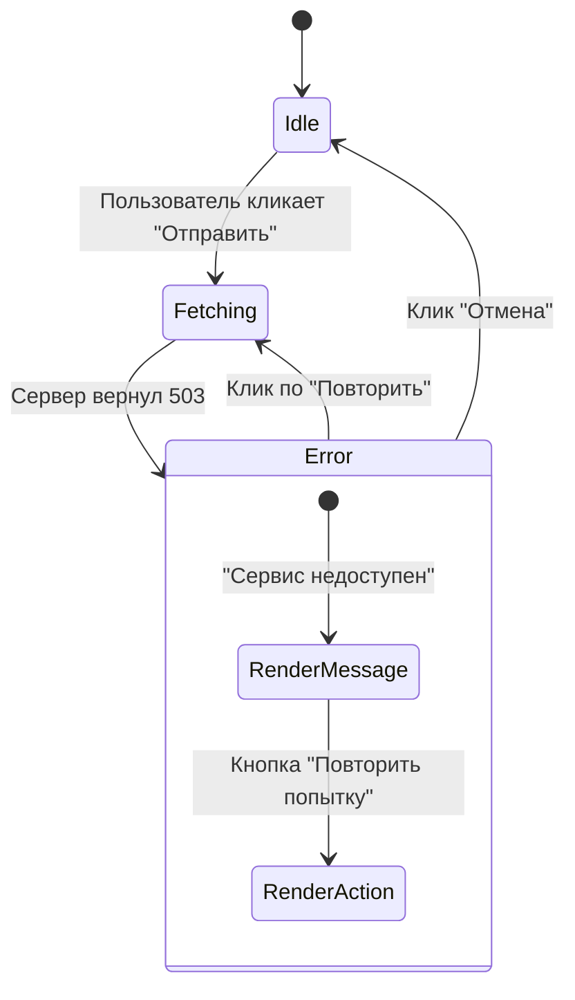

# Error States (Состояния ошибки)

**Error States** — это состояния пользовательского интерфейса, которые информируют пользователя о том, что операция не удалась, объясняют причину (на понятном языке) и, самое главное, предлагают путь решения проблемы.

## Какую боль мы решаем?
Многие разработчики обрабатывают ошибки по остаточному принципу. Самые частые антипаттерны: 
1. **Молчаливое падение (Silent Fail):** Пользователь нажимает кнопку, запрос падает с 500 ошибкой, но в UI ничего не происходит. Пользователь яростно кликает еще 10 раз.
2. **Технический сброс:** На экран выводится красным текстом `Uncaught TypeError: undefined is not a function`. Это пугает обывателя.
3. **Тупик:** "Произошла ошибка". Без кнопки "Повторить" или возможности вернуться назад.

## Как это работает?
Хороший Error State должен перехватить ошибку сети или бизнес-логики и отрендерить специальный компонент-заглушку или тост-уведомление.



### Наглядный пример

**Антипаттерн (Техническая и тупиковая ошибка):**
```tsx
const DataView = () => {
  const { data, error } = useFetch('/api/data');

  if (error) {
    // Пользователь не программист, ему это ни о чем не говорит
    return <div className="text-red-500">{error.message}</div>; 
  }
  
  return <div>{data}</div>;
};
```

**Правильное решение (Пользовательский Error State):**
```tsx
const DataView = () => {
  const { data, error, retry } = useFetch('/api/data');

  if (error) {
    return (
      <div className="flex flex-col items-center p-4 bg-red-50 rounded-lg">
        <Icon name="alert-triangle" className="text-red-500" />
        <h4 className="font-bold text-red-900">Не удалось загрузить ленту</h4>
        <p className="text-red-700 text-sm">Проверьте подключение к интернету.</p>
        <button onClick={retry} className="mt-2 btn-secondary">
          Попробовать снова
        </button>
      </div>
    );
  }
  
  return <div>{data}</div>;
};
```

## Неочевидные нюансы и границы применимости
* **Системные ошибки vs Ошибки бизнес-логики:** Различайте их. Если сервер вернул 500 (упала БД) — нужен глобальный/локальный Error State с кнопкой "Повторить". Если сервер вернул 400 (Неверный формат email) — это ошибка бизнес-логики, она должна отображаться как красная подсветка под конкретным `input`, а не заменять всю форму на страницу с ошибкой.
* **Сохранение контекста:** Если пользователь заполнял форму 20 минут, и при отправке произошла ошибка сети, **ни в коем случае** не стирайте введенные данные! Error State должен появиться поверх или рядом, но состояние формы должно сохраниться, чтобы пользователь мог просто нажать "Отправить" еще раз.
* **Геймификация ошибок:** 404 страницы часто делают забавными (динозаврики, лабиринты). Это хорошая практика для некритичных путей, она снижает стресс пользователя от сбоя.
