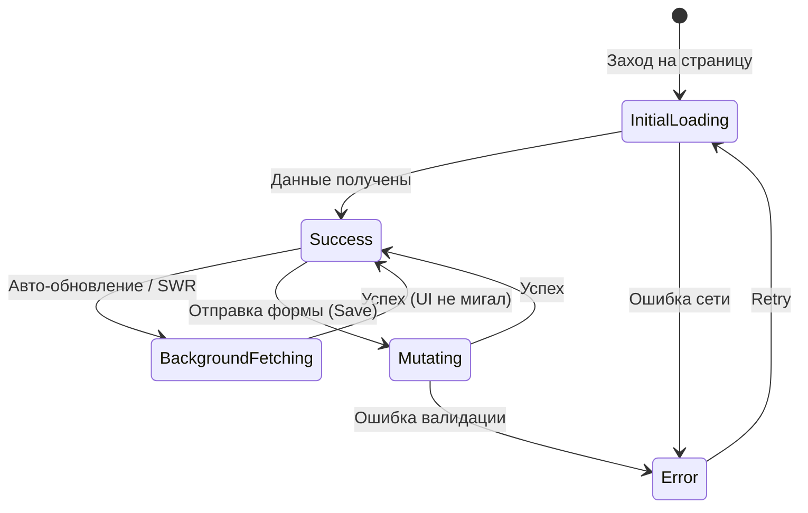

Проектирование состояний загрузки (Loading States) — один из важнейших аспектов UX. Долгая загрузка без обратной связи вызывает фрустрацию, а неправильная реализация загрузочных состояний приводит к визуальному мусору (например, мерцающим лоадерам).

## Проблема (Боль)

Разработчики часто забывают обработать промежуточные состояния, фокусируясь только на идеальном сценарии ("счастливом пути"). Либо впадают в другую крайность: вешают глобальный спиннер, блокирующий весь экран при каждом мелком запросе.

### Антипаттерн: " Spinner Soup" (Суп из спиннеров)
```tsx
// ❌ Плохо: Множество независимых спиннеров создают визуальный хаос
function Dashboard() {
  const { data: user, isLoading: isUserLoading } = useUser();
  const { data: stats, isLoading: isStatsLoading } = useStats();
  const { data: feed, isLoading: isFeedLoading } = useFeed();

  return (
    <div>
      <Sidebar>
        {isUserLoading ? <Spinner /> : <UserProfile user={user} />}
      </Sidebar>
      <MainContent>
        {isStatsLoading ? <Spinner /> : <StatCards stats={stats} />}
        {isFeedLoading ? <Spinner /> : <Feed feed={feed} />}
      </MainContent>
    </div>
  );
}
```
Такой подход заставляет экран мерцать: одни части загружаются быстрее других, элементы постоянно смещаются (Layout Shift), и приложение кажется нестабильным и "дерганым".

## Решение: Иерархия и Стратегии загрузки

Состояния загрузки должны проектироваться в зависимости от контекста. Основные подходы:

1. **Глобальная загрузка (Full-screen loading):** Только при первичной инициализации приложения (например, проверка токена авторизации).
2. **Скелетоны (Skeleton Screens):** Для основных контентных блоков. Они повторяют структуру контента, предотвращая скачки верстки (Layout Shifts).
3. **Локальные индикаторы (Inline spinners / Disabled states):** Для кнопок и форм при отправке данных (мутациях).
4. **Фоновая загрузка (Background Refetching):** Если данные обновляются, мы показываем старые данные и маленький индикатор, не блокируя UI.

### Архитектура переходов состояний



### Как это выглядит (Хороший пример)

Используем Скелетоны и группировку загрузки с помощью React Suspense.

```tsx
// ✅ Хорошо: Использование Suspense для декларативной загрузки
import { Suspense } from 'react';

function Dashboard() {
  return (
    <div className="layout">
      {/* Боковая панель грузится со своим скелетом */}
      <Suspense fallback={<SidebarSkeleton />}>
        <SidebarContent />
      </Suspense>

      <main>
        {/* Графики и лента объединены одним скелетом, 
            они появятся одновременно, предотвращая "суп из спиннеров" */}
        <Suspense fallback={<DashboardSkeleton />}>
          <StatCards />
          <Feed />
        </Suspense>
      </main>
    </div>
  );
}
```

## Трейдоффы и границы применимости

### Когда использовать Скелетоны ✅
- При загрузке списков, таблиц, карточек товаров, профилей.
- Когда форма и размер контента примерно известны заранее.

### Когда использовать Спиннеры (Крутилки) 🔄
- Внутри кнопок при отправке формы (`<Button loading>Submit</Button>`).
- Для непредсказуемого по размеру контента (например, графика, которая может быть любого размера).
- При подгрузке данных в бесконечном скролле (в самом низу списка).

### Неочевидные нюансы

1. **Проблема быстрых запросов (Flash of Loading State):**
   Если интернет очень быстрый (запрос длится 50мс), то показ скелетона или спиннера на 50мс вызовет эффект вспышки, что раздражает зрение.
   *Решение:* Использовать задержку перед показом лоадера. Показывать лоадер только если запрос длится дольше 200-300мс (в React это можно реализовать через `useTransition` или специальные хуки задержки).

2. **Оптимистичный UI (Optimistic UI):**
   Вместо того чтобы ждать завершения запроса (например, при постановке лайка), интерфейс мгновенно обновляется, предполагая успешный ответ. Если запрос падает, происходит откат (rollback) состояния. Это полностью убирает необходимость в локальных состояниях загрузки для простых действий.

3. **Блокировка действий:** 
   При локальной загрузке важно не забывать блокировать интерактивные элементы. Если кнопка "Оплатить" в состоянии загрузки, она должна быть `disabled`, чтобы предотвратить двойное списание средств.
