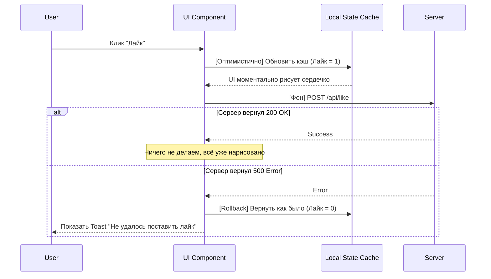

# Optimistic UI (Оптимистичный интерфейс)

**Optimistic UI** — это паттерн проектирования, при котором пользовательский интерфейс обновляется немедленно после действия пользователя, не дожидаясь ответа от сервера. Приложение "оптимистично" предполагает, что серверный запрос завершится успехом.

## Какую боль мы решаем?
В классическом (пессимистичном) UI каждое действие сопровождается спиннером. Нажал "Лайк" -> появился спиннер на полсекунды -> сердечко стало красным. На мобильном интернете с пингом 300мс приложение начинает казаться медленным, "вязким" и не отзывчивым. Оптимистичный UI дает иллюзию мгновенной работы приложения с нулевой задержкой.

## Как это работает?
1. Пользователь совершает действие.
2. UI мутирует локальное состояние моментально.
3. В фоне отправляется реальный сетевой запрос.
4. Если сервер отвечает OK — ничего не делаем (ведь UI уже обновился).
5. Если сервер отвечает ошибкой — мы тихо **откатываем (rollback)** UI к предыдущему состоянию и показываем тост с ошибкой.



### Наглядный пример

**Правильное решение (Использование React Query):**
```tsx
const useToggleLike = (postId) => {
  const queryClient = useQueryClient();

  return useMutation({
    mutationFn: () => fetch(`/api/posts/${postId}/like`, { method: 'POST' }),
    
    // Срабатывает МГНОВЕННО при вызове мутации
    onMutate: async () => {
      await queryClient.cancelQueries(['post', postId]);
      const previousPost = queryClient.getQueryData(['post', postId]);

      // 1. Оптимистично обновляем кэш
      queryClient.setQueryData(['post', postId], old => ({
        ...old,
        likesCount: old.likesCount + 1,
        isLiked: true
      }));

      // 2. Возвращаем старые данные на случай ошибки
      return { previousPost };
    },
    
    // Если сервер вернул ошибку
    onError: (err, variables, context) => {
      // 3. Откатываем UI (Rollback)
      queryClient.setQueryData(['post', postId], context.previousPost);
      toast.error('Ошибка при лайке');
    }
  });
};
```

## Неочевидные нюансы и границы применимости
* **Где НЕ стоит применять:** Никогда не используйте Optimistic UI для критических, необратимых или финансовых транзакций! Если пользователь переводит 10 000 рублей, вы не должны оптимистично рисовать "Перевод успешен", пока сервер не подтвердит операцию. Иначе откат (rollback) вызовет у пользователя сердечный приступ.
* **Идемпотентность:** Действия должны быть безопасны для повторения. 
* **Сложность синхронизации:** Если в момент оптимистичного "лайка" через WebSocket прилетает реальное обновление от другого пользователя, нужно аккуратно разруливать конфликты в кэше.
