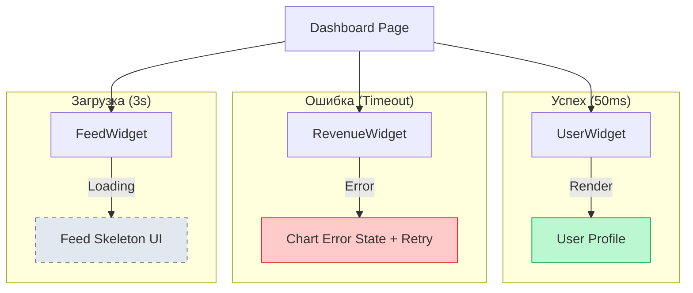

# Partial States (Частичные состояния)

**Partial States (Частичные состояния)** — это архитектурный подход к загрузке и обработке ошибок, при котором интерфейс не ждет полной готовности всех данных, а рендерит те части, которые уже доступны, показывая локальные скелетоны или состояния ошибок для остальных блоков.

## Какую боль мы решаем?
Представьте сложный дашборд: в центре — график доходов за год (тяжелый запрос к аналитической БД на 3 секунды), сбоку — профиль пользователя (быстрый запрос на 50мс).
**Антипаттерн "Всё или ничего":** Приложение показывает глобальный белый экран со спиннером целых 3 секунды, заставляя пользователя ждать график, хотя профиль он мог бы увидеть почти мгновенно. 
Partial States решают проблему "наименьшего общего знаменателя" по времени загрузки.

## Как это работает?
Дерево UI разбивается на независимые блоки (виджеты). Каждый блок инкапсулирует свой собственный жизненный цикл: сам запрашивает данные, сам показывает свой скелетон при загрузке, сам перехватывает свои ошибки.



### Наглядный пример

**Антипаттерн (Ожидание всех данных на уровне страницы):**
```tsx
const Dashboard = () => {
  // Ждем ВСЕ промисы. Медленный запрос тормозит всё.
  const [user, chart, feed] = await Promise.all([
    fetchUser(), 
    fetchHeavyChart(), 
    fetchFeed()
  ]);

  if (!user || !chart || !feed) return <GlobalSpinner />;

  return <Layout user={user} chart={chart} feed={feed} />;
};
```

**Правильное решение (Partial States с React Suspense & Error Boundaries):**
```tsx
const Dashboard = () => {
  return (
    <Layout>
      {/* Профиль загрузится быстро и сразу покажется */}
      <Suspense fallback={<UserSkeleton />}>
        <UserProfile /> 
      </Suspense>

      {/* График будет крутить свой скелетон 3 секунды */}
      <ErrorBoundary FallbackComponent={ChartErrorState}>
        <Suspense fallback={<ChartSkeleton />}>
          <HeavyRevenueChart />
        </Suspense>
      </ErrorBoundary>

      <Suspense fallback={<FeedSkeleton />}>
        <NewsFeed />
      </Suspense>
    </Layout>
  );
};
```

## Неочевидные нюансы и границы применимости
* **Связность данных (Data Dependencies):** Не все можно разбить на независимые блоки. Если для отображения графика ДОХОДОВ вам обязательно нужен ID пользователя (который грузится в `UserProfile`), вы не сможете загружать их параллельно. Возникнет "водопад" (waterfall).
* **"Эффект попкорна" (Layout Shift):** Если у вас 10 мелких независимых виджетов, и они загружаются в разное время (один через 100мс, другой через 300мс, третий через 1с), страница будет "дергаться" и мерцать, как попкорн в микроволновке. В таких случаях лучше искусственно группировать загрузки с помощью общих Suspense Boundaries.
* **Перегрузка сервера:** 10 независимых виджетов = 10 независимых HTTP запросов к серверу. Если страница нагружена, возможно, дешевле собрать все данные одним большим GraphQL запросом или Backend-For-Frontend (BFF), смирившись с ожиданием.
