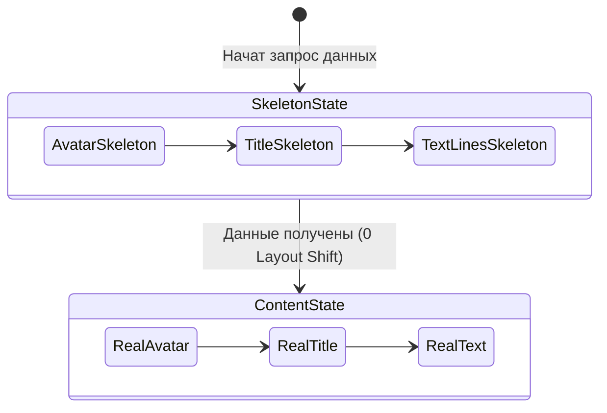

# Skeleton Architecture (Скелетные загрузки)

**Скелетная архитектура (Skeleton Screens)** — это шаблон проектирования UI, при котором вместо вращающихся спиннеров (throbbers) во время загрузки данных отображается пустая, стилизованная версия контента, повторяющая его будущую форму и структуру.

## Какую боль мы решаем?
1. **Layout Shift (Прыжки верстки):** Когда маленький спиннер 32x32px внезапно заменяется на огромную карточку товара высотой 500px, весь контент ниже резко "уезжает" вниз. Это ужасный UX и пенальти от Google (метрика CLS). Скелетон резервирует место заранее.
2. **Восприятие времени (Perceived Performance):** Психологически пользователю кажется, что приложение работает быстрее, если он видит структуру будущего контента, а не гипнотизирующий спиннер. Приложение выглядит "почти готовым".

## Как это работает?
Создаются специальные компоненты-заглушки. Они часто имеют пульсирующую или переливающуюся (shimmer) CSS-анимацию, чтобы показать, что процесс идет.



### Наглядный пример

**Правильное решение (Скелетон, повторяющий структуру):**
```tsx
// Карточка, которая будет отрендерена с реальными данными
const UserCard = ({ user }) => (
  <div className="flex gap-4 p-4 border rounded">
    
    <div>
      <h3 className="text-lg font-bold">{user.name}</h3>
      <p className="text-gray-500">{user.email}</p>
    </div>
  </div>
);

// Скелетон, ТОЧНО повторяющий верстку карточки, но с заглушками
const UserCardSkeleton = () => (
  <div className="flex gap-4 p-4 border rounded animate-pulse">
    {/* Резервируем место под аватар: тот же размер 12x12 */}
    <div className="w-12 h-12 rounded-full bg-gray-200"></div>
    <div className="flex flex-col gap-2 w-full">
      {/* Резервируем место под заголовок */}
      <div className="h-5 bg-gray-200 rounded w-1/3"></div>
      {/* Резервируем место под текст */}
      <div className="h-4 bg-gray-200 rounded w-2/3"></div>
    </div>
  </div>
);
```

## Неочевидные нюансы и границы применимости
* **Двойная поддержка (Double Maintenance):** Это главный минус архитектуры. Если дизайнер решит перенести аватарку справа налево, вам придется менять верстку в **двух** местах: в `UserCard` и в `UserCardSkeleton`. Забудете обновить скелетон — получите дерганный интерфейс при загрузке.
* **Over-engineering:** Не делайте скелетоны для списков, где количество элементов неизвестно. Обычно рендерят 3-5 фейковых карточек. Если придет 1 элемент, часть скелетонов просто исчезнет (небольшой шифт), это нормально.
* **Мерцание (Flickering):** Если у вас быстрый интернет, данные могут загрузиться за 50мс. Пользователь увидит вспышку скелетона на долю секунды, что выглядит как глитч. Хорошая практика — показывать скелетон только если запрос длится дольше 200-300мс (задержка перед отображением загрузки).
