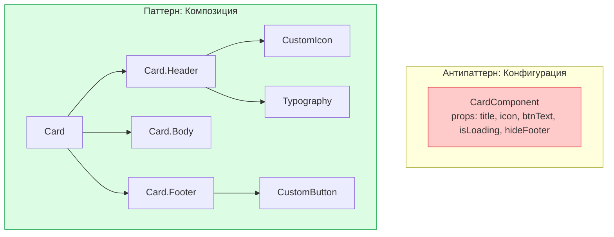

# Composition over Configuration (Композиция вместо конфигурации)

**Composition over Configuration** — это фундаментальный принцип проектирования компонентов, который гласит: лучше строить сложный UI путем сборки (композиции) простых компонентов через `children`, чем создавать один "монолитный" компонент, управляемый десятками настроек (props).

## Какую боль мы решаем?
Разработчик создает компонент `<Card />`. Сначала ему нужен пропс `title`. Потом дизайнер добавляет иконку — появляется пропс `icon`. Потом кнопку — `hasButton`, `buttonText`, `onButtonClick`. Через год эта карточка принимает 30 пропсов (`isLoading`, `footerAlign`, `isReversed`) и внутри выглядит как бесконечная лапша из `if/else`. Это называется **"Apropcalypse"** (Апокалипсис пропсов).

## Как это работает?
Вместо того чтобы программировать все возможные вариации внутрь одного компонента, мы делаем компонент "глупым" контейнером (или набором контейнеров), в который пользователь сам вставляет то, что ему нужно.



### Наглядный пример

**Антипаттерн (Конфигурация через Props):**
```tsx
// ❌ Монолит, который знает слишком много
<Dialog 
  isOpen={true}
  title="Удалить файл?"
  content="Это действие необратимо."
  confirmText="Да, удалить"
  cancelText="Отмена"
  onConfirm={handleDelete}
  onCancel={close}
  showCloseIcon={true}
  isDestructive={true}
/>
```

**Правильное решение (Композиция):**
```tsx
// ✅ Гибкая сборка. Разработчик сам решает, как выглядит контент.
<Dialog isOpen={true} onClose={close}>
  <Dialog.Header>
    <Dialog.Title>Удалить файл?</Dialog.Title>
    <Dialog.CloseButton />
  </Dialog.Header>
  <Dialog.Body>
    <p>Это действие необратимо.</p>
  </Dialog.Body>
  <Dialog.Footer>
    <Button variant="ghost" onClick={close}>Отмена</Button>
    <Button variant="danger" onClick={handleDelete}>Да, удалить</Button>
  </Dialog.Footer>
</Dialog>
```

## Неочевидные нюансы и границы применимости
* **Многословность (Boilerplate):** Композиция требует больше строк кода в месте вызова. Для компонентов, которые используются 1000 раз в проекте в абсолютно идентичном виде (например, базовая синяя кнопка), композиция излишня — хватит и пропсов.
* **Инверсия контроля (Inversion of Control):** Композиция передает ответственность за внешний вид вызывающему коду. Создатель компонента `<Dialog>` больше не контролирует, в каком порядке пользователь отрендерит Header и Footer.
* **Смешанный подход:** В реальном мире часто используется "золотая середина". Вы создаете базовые композитные компоненты (как во втором примере), а для самых частых юзкейсов создаете надстройку-обертку (`<ConfirmDialog />`), которая принимает конфигурацию.
