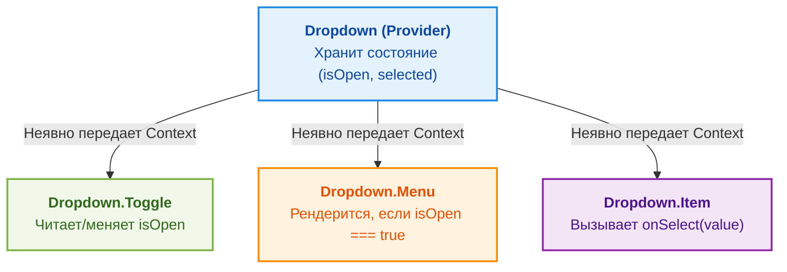

Паттерн Compound Components (составные компоненты) — это архитектурный подход в React, при котором несколько компонентов работают вместе, разделяя общее неявное состояние, чтобы выполнить единую задачу. Это позволяет создавать гибкие и выразительные API для сложных UI-элементов.

## Проблема (Боль)

Представьте, что мы создаем компонент `Select` или `Dropdown`. Изначально мы можем попытаться передать все данные и настройки через `props`.

### Антипаттерн: "Божественный" компонент (Props Drilling & God Component)
```tsx
// ❌ Плохо: компонент перегружен пропсами. API становится негибким.
<Dropdown
  options={[{ value: '1', label: 'Option 1' }]}
  onSelect={handleSelect}
  showIcon={true}
  customIcon={<MyIcon />}
  menuStyle={{ padding: 10 }}
  itemClassName="my-item"
  renderItem={(item) => <span>{item.label}</span>}
/>
```
Когда требования к дизайну меняются (например, нужно добавить разделитель между опциями или сгруппировать их), нам приходится добавлять новые флаги и функции рендера в `props`. Компонент превращается в запутанного монстра.

## Решение: Compound Components

Вместо одного монолитного компонента мы создаем набор связанных компонентов. Главный компонент-обертка предоставляет контекст, а дочерние компоненты (составные части) его потребляют.

### Как это выглядит (Хороший пример)
```tsx
// ✅ Хорошо: Декларативно и гибко
<Dropdown onSelect={handleSelect}>
  <Dropdown.Toggle>
    <MyIcon /> Выберите опцию
  </Dropdown.Toggle>
  <Dropdown.Menu>
    <Dropdown.Item value="1">Option 1</Dropdown.Item>
    <Dropdown.Divider />
    <Dropdown.Item value="2">Option 2</Dropdown.Item>
  </Dropdown.Menu>
</Dropdown>
```

### Как это работает под капотом



Реализация строится на базе **React Context**:
```tsx
import { createContext, useContext, useState, ReactNode } from 'react';

// 1. Создаем контекст
const DropdownContext = createContext<{
  isOpen: boolean;
  toggle: () => void;
} | null>(null);

// 2. Главный компонент
export function Dropdown({ children }: { children: ReactNode }) {
  const [isOpen, setIsOpen] = useState(false);
  const toggle = () => setIsOpen((prev) => !prev);

  return (
    <DropdownContext.Provider value={{ isOpen, toggle }}>
      <div className="relative inline-block">{children}</div>
    </DropdownContext.Provider>
  );
}

// 3. Составные части
Dropdown.Toggle = function Toggle({ children }: { children: ReactNode }) {
  const ctx = useContext(DropdownContext);
  if (!ctx) throw new Error("Toggle must be used within a Dropdown");
  
  return <button onClick={ctx.toggle}>{children}</button>;
};

Dropdown.Menu = function Menu({ children }: { children: ReactNode }) {
  const ctx = useContext(DropdownContext);
  if (!ctx || !ctx.isOpen) return null;
  
  return <div className="absolute border shadow-lg">{children}</div>;
};
```

## Трейдоффы и границы применимости

### Когда использовать ✅
- **Сложные UI-компоненты:** Tabs, Accordions, Dropdowns, Modals, Steppers.
- **Публичные UI-киты:** Когда вы делаете библиотеку компонентов для других разработчиков и не можете предсказать все возможные варианты использования.
- **Необходимость инверсии контроля (Inversion of Control):** Когда потребитель компонента должен сам решать, в каком порядке располагать элементы.

### Когда НЕ использовать ❌
- **Простые компоненты:** Не нужно делать составной компонент для простой кнопки или бейджа. Это добавит ненужный бойлерплейт.
- **Жестко заданная структура:** Если по дизайну элементы *всегда* должны идти в строгом порядке и вы хотите запретить разработчикам этот порядок менять, Compound Components могут дать слишком много свободы, что приведет к нарушению UI-гайдлайнов.

### Неочевидные нюансы
- **Валидация дочерних элементов:** Сложно гарантировать, что разработчик не вставит внутрь `<Dropdown>` случайный `<div>` вместо `<Dropdown.Item>`.
- **Оверхед на Context:** Если составных компонентов на странице сотни (например, большая таблица), создание отдельных контекстов для каждой ячейки может ударить по производительности. В таких случаях лучше вернуться к пропсам или паттерну *Render Props*.
