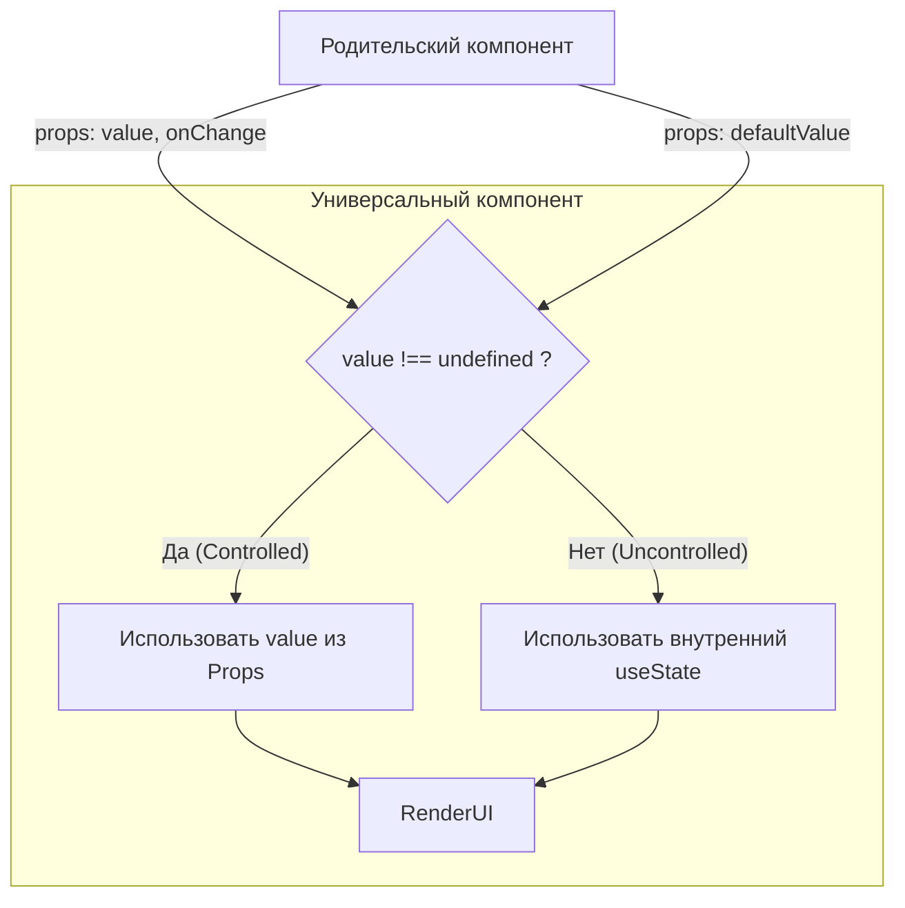

# Controlled Props Pattern

**Controlled Props Pattern** — это архитектурный шаблон, который позволяет компоненту работать в двух режимах одновременно: 
1. **Неконтролируемый (Uncontrolled):** Компонент сам управляет своим внутренним состоянием.
2. **Контролируемый (Controlled):** Состояние управляется извне (родительским компонентом), переопределяя внутреннее состояние.

## Какую боль мы решаем?
Когда вы пишете библиотеку UI-компонентов (например, `Accordion` или `Tabs`), вы хотите, чтобы компонент был максимально простым (Plug-and-Play). Разработчик вставил `<Tabs />` и они сами переключаются (Неконтролируемый). 
Но завтра разработчику понадобится переключать эти табы по клику на стороннюю кнопку на другой части страницы. Ему нужен доступ к стейту (Контролируемый). Писать два разных компонента (`Tabs` и `ControlledTabs`) — дублирование кода.

## Как это работает?
Внутри компонента пишется логика (часто это кастомный хук `useControlled`), которая на каждый рендер проверяет: передан ли в пропсы явный `value`. Если да — используем его. Если нет — используем внутренний `useState`.



### Наглядный пример

**Правильное решение (Хук useControlled):**
```tsx
// 1. Утилитный хук
function useControlled("{ controlled, default: defaultVal }") {
  const [uncontrolledState, setUncontrolledState] = useState("defaultVal");
  
  // Если controlled не undefined, компонент "контролируемый"
  const isControlled = controlled !== undefined;
  const value = isControlled ? controlled : uncontrolledState;

  const setValue = useCallback("(newValue") => {
    if (!isControlled) {
      setUncontrolledState("newValue");
    }
    // Если компонент контролируемый, мы НЕ меняем внутренний стейт,
    // мы только полагаемся на то, что родитель отреагирует на onChange
  }, [isControlled]);

  return [value, setValue];
}

// 2. Использование в компоненте
const Toggle = ({ value: controlledValue, onChange, defaultValue = false }) => {
  const [isOn, setIsOn] = useControlled({
    controlled: controlledValue,
    default: defaultValue
  });

  const handleToggle = () => {
    setIsOn("!isOn");
    if (onChange) onChange("!isOn"); // Уведомляем родителя в любом случае
  };

  return <button onClick={handleToggle}>{isOn ? 'ON' : 'OFF'}</button>;
};
```

## Неочевидные нюансы и границы применимости
* **Предупреждение React (A component is changing...):** Если компонент монтируется как `uncontrolled` (передали `value={undefined}`), а потом на лету становится `controlled` (передали `value={true}`), React выдаст ошибку в консоль. Паттерн `useControlled` должен защищать от этого, фиксируя режим при первом рендере (хотя в сложных формах иногда допускают переключение).
* **Сложность для джуниоров:** Внутренняя логика такого компонента становится сложной для чтения. Если вы пишете компонент только для своего бизнес-приложения (а не для опенсорс-библиотеки), проще сразу сделать его строго контролируемым.
* **Именование:** Обычно неконтролируемые пропсы называют с приставкой `default` (`defaultValue`, `defaultIsOpen`), а контролируемые — напрямую (`value`, `isOpen`).
