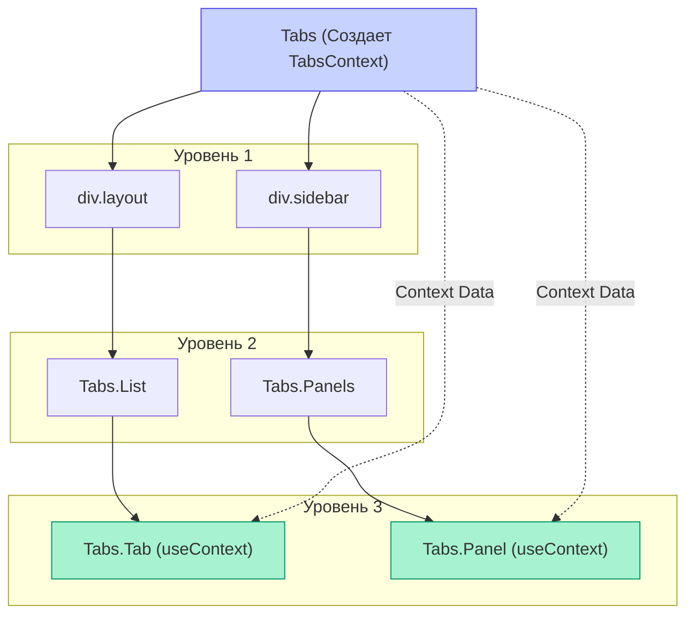

# Flexible Compound Components

**Flexible Compound Components (Гибкие составные компоненты)** — это эволюция классического паттерна Compound Components. В отличие от жесткой привязки родителя к прямым потомкам, гибкий паттерн позволяет вкладывать дочерние компоненты на любую глубину внутри родителя.

## Какую боль мы решаем?
В классическом варианте (через `React.Children.map` и `cloneElement`) родительский компонент перебирает только своих **прямых** детей. Если разработчик попытается обернуть дочерний элемент (например, `<Tab>`) в дополнительный `<div>` для стилизации, связь разорвется, и компонент сломается, так как пропсы не дойдут до адресата.

## Как это работает?
Для передачи состояния и функций-обработчиков от родительского компонента к дочерним используется не прямое клонирование элементов, а **React Context API**. Любой вложенный дочерний элемент может обратиться к контексту и получить нужные данные, независимо от того, на каком уровне вложенности он находится.



### Наглядный пример

**Антипаттерн (Классический Compound — сломается из-за div):**
```tsx
<Tabs>
  {/* ОШИБКА: Tabs клонирует div, а не List! List не получит пропсы! */}
  <div className="custom-wrapper"> 
    <Tabs.List>...</Tabs.List>
  </div>
</Tabs>
```

**Правильное решение (Flexible Compound через Context):**
```tsx
const TabsContext = createContext();

// Родитель провайдит стейт
const Tabs = ({ children }) => {
  const [activeTab, setActiveTab] = useState(0);
  return (
    <TabsContext.Provider value={{ activeTab, setActiveTab }}>
      {children}
    </TabsContext.Provider>
  );
};

// Ребенок потребляет стейт откуда угодно
Tabs.Tab = ({ index, children }) => {
  const { activeTab, setActiveTab } = useContext(TabsContext);
  const isActive = activeTab === index;
  
  return (
    <button onClick={() => setActiveTab(index)} className={isActive ? 'active' : ''}>
      {children}
    </button>
  );
};
```

## Неочевидные нюансы и границы применимости
* **Проблема ререндеров:** Так как используется Context API, любое изменение состояния в `Tabs` (например, смена активного таба) заставит перерендериться **все** дочерние компоненты, которые читают этот контекст. Для компонентов с десятками элементов это может ударить по производительности (решается мемоизацией).
* **Привязка к родителю:** Компоненты вроде `Tabs.Tab` не имеют смысла и сломаются, если отрендерить их вне провайдера `<Tabs>`. Хорошая практика — писать безопасный хук-обертку: `if (!context) throw new Error("Tabs.Tab must be used within Tabs")`.
* **Избыточность:** Если компонент тривиальный (например, `Label` и `Input`), городить Context ради них не стоит. Классического Compound через `cloneElement` или простого прокидывания пропсов будет достаточно.
