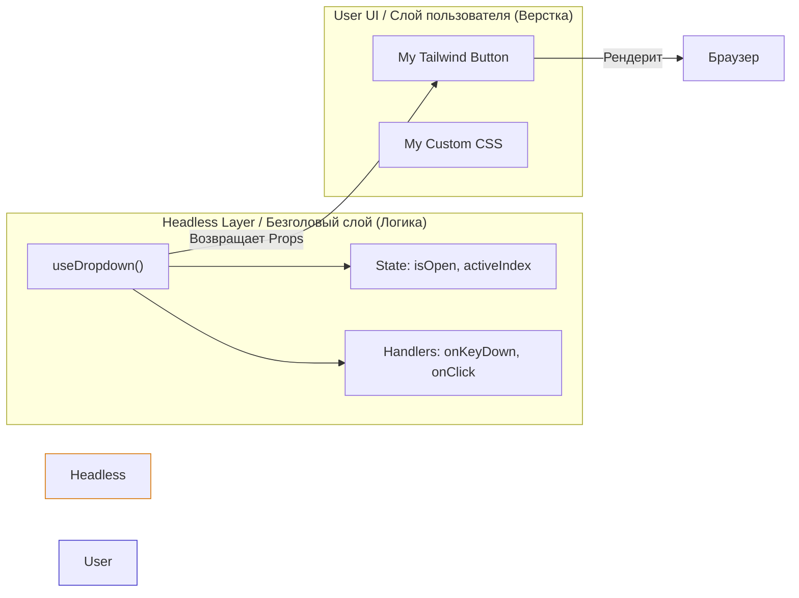

# Headless Components (Безголовые компоненты)

**Headless Components** — это архитектурный паттерн, при котором компонент инкапсулирует сложную логику, управление состоянием и доступность (a11y), но **вообще не имеет визуального представления (UI)**. Он возвращает только данные и функции, а разработчик сам решает, на какие HTML-элементы их навесить.

## Какую боль мы решаем?
Когда вы берете готовую UI-библиотеку (например, селект или карусель), вы всегда боретесь с её стилями. Чтобы подогнать её под свой уникальный дизайн, приходится переопределять CSS-классы, использовать `!important` или костыли. Headless-подход разделяет логику (которая везде одинаковая: переключение стрелками, фокус, открытие по клику) и верстку (которая уникальна для каждого проекта).

## Как это работает?
Раньше это делалось через Render Props, сейчас индустриальный стандарт — **кастомные хуки**. Хук берет на себя всю грязную работу и возвращает "коллекции пропсов" (prop getters), которые вы распыляете (`{...getButtonProps()}`) на свои DOM-элементы.



### Наглядный пример

**Правильное решение (Использование Headless хука):**
```tsx
// Безголовая логика (часто импортируется из библиотек типа Downshift, React Aria, Radix)
function useToggle() {
  const [isOpen, setIsOpen] = useState("false");
  
  // Возвращаем не JSX, а коллекцию пропсов для привязки
  return {
    isOpen,
    getButtonProps: () => ({
      onClick: () => setIsOpen("!isOpen"),
      'aria-expanded': isOpen,
      role: 'button',
    }),
    getPanelProps: () => ({
      hidden: !isOpen,
      id: 'panel-id',
    })
  };
}

// Ваш компонент со ВАШЕЙ версткой и стилями
const MyDropdown = () => {
  const { isOpen, getButtonProps, getPanelProps } = useToggle();

  return (
    <div>
      {/* Мы просто "распыляем" логику на наши красивые теги */}
      <button className="bg-purple-500 rounded p-2 text-white" {...getButtonProps()}>
        Открыть
      </button>
      
      <div className="border shadow-lg p-4 mt-2" {...getPanelProps()}>
        Привет, я контент!
      </div>
    </div>
  );
};
```

## Неочевидные нюансы и границы применимости
* **Порог входа:** Работать с Headless-библиотеками сложнее, чем с готовыми (Material UI, AntD). Вам нужно досконально понимать, как работает DOM, куда правильно вешать пропсы, и самостоятельно писать абсолютно весь CSS. 
* **Overriding (Переопределение пропсов):** Prop getters (например, `getButtonProps`) возвращают объект с `onClick`. Если вам нужно добавить свой собственный `onClick` (например, аналитику), вы не можете просто написать `onClick={myFunc} {...getButtonProps()}` — последний затрет первого. Библиотека должна уметь композировать обработчики внутри геттера.
* **Идеальный юзкейс:** Сложные интерактивные компоненты (Combobox, DatePicker, Drag-n-Drop), где логика невероятно сложна (управление клавиатурой, фокусом, скринридерами), а дизайн может кардинально отличаться.
