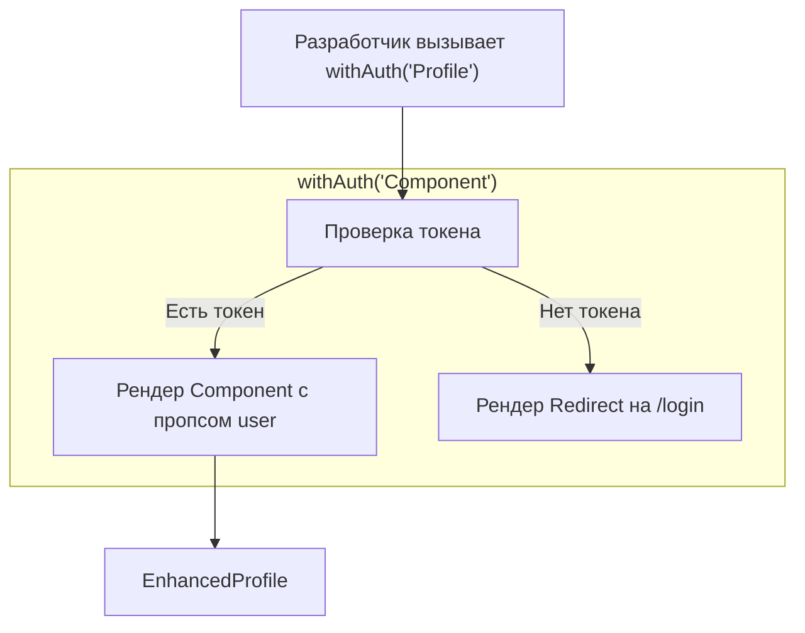

# Higher Order Components (HOC)

**Higher Order Components (Компоненты высшего порядка)** — это паттерн, представляющий собой функцию, которая принимает React-компонент и возвращает новый, "улучшенный" компонент. По сути, это паттерн "Декоратор" для UI.

## Какую боль мы решаем?
Во времена классовых компонентов выносить общую логику жизненного цикла (например, проверку авторизации при монтировании или подписку на Redux) было очень сложно. Приходилось копировать методы `componentDidMount` из файла в файл. HOC позволил оборачивать компоненты, наделяя их суперспособностями снаружи, не трогая их внутренний код.

## Как это работает?
HOC — это не компонент, это *функция*, создающая компонент. Она принимает "глупый" компонент, оборачивает его в контейнер, который выполняет логику, и передает результат этой логики в виде дополнительных пропсов.



### Наглядный пример

**Правильное решение (Классический HOC):**
```tsx
// 1. Пишем HOC
const withAuth = (WrappedComponent) => {
  // Возвращаем новый компонент
  return function EnhancedComponent("props") {
    const user = getAuthUser(); // Какая-то логика
    
    if (!user) {
      return <div>Доступ запрещен. Залогиньтесь.</div>;
    }
    
    // Прокидываем оригинальные пропсы + новые данные
    return <WrappedComponent {...props} user={user} />;
  };
};

// 2. У нас есть глупый компонент
const Profile = ({ user, theme }) => <div>Привет, {user.name}! Тема: {theme}</div>;

// 3. Создаем умный
const ProtectedProfile = withAuth("Profile");

// Вызов в App:
// <ProtectedProfile theme="dark" />
```

## Неочевидные нюансы и границы применимости
* **Устаревание:** С выходом React Hooks в 2019 году необходимость в HOC отпала на 95%. То, что делал `withAuth`, теперь проще и чище делает кастомный хук `useAuth()`, вызванный прямо внутри `Profile`.
* **Wrapper Hell (Ад обёрток):** Если компоненту нужно 5 "суперспособностей", вы получаете `withRouter("withAuth(withTheme(withData(Profile"))))`. В DevTools это выглядит как бесконечное дерево бесполезных узлов.
* **Коллизия пропсов:** Если два разных HOC'а попытаются передать пропс с одинаковым именем (например, `data`), один молча перезапишет другой, и вы потратите часы на дебаг. Хуки решают эту проблему, так как вы сами называете переменные при деструктуризации (`const { data: authData } = useAuth()`).
