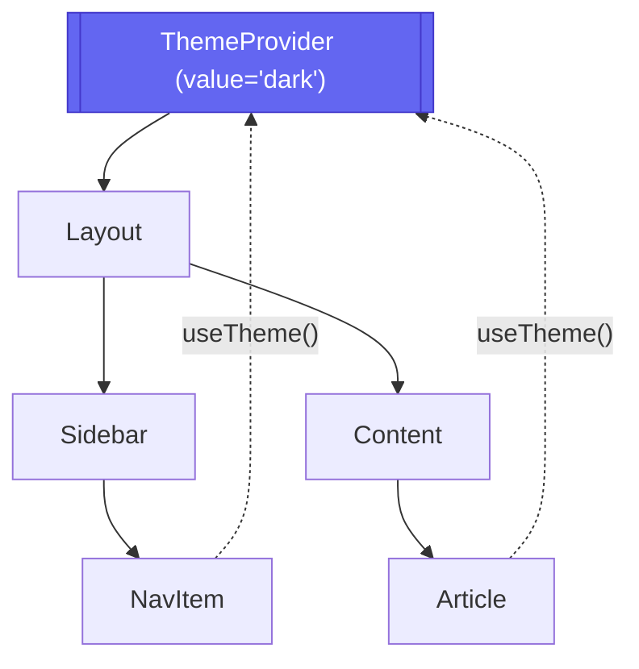

# Provider Pattern

**Provider Pattern (Паттерн Провайдер)** — это архитектурный шаблон React, который использует Context API для предоставления глобальных (или локальных поддеревных) данных и функций множеству компонентов без необходимости передавать их через props на каждом уровне.

## Какую боль мы решаем?
Когда у вас есть данные, которые нужны "вообще везде" (цветовая тема, данные авторизованного пользователя, текущая локализация, инстанс роутера), передавать их через пропсы (Props Drilling) от `App` до `Button` через 15 слоев — это издевательство над архитектурой. Компоненты, которые только транслируют эти пропсы, становятся жестко связанными с данными, которые им самим не нужны.

## Как это работает?
В корне приложения (или поддерева) ставится компонент-обертка (`Provider`), который содержит состояние. Любой компонент внутри этого дерева может объявить себя потребителем (`Consumer` или вызвать `useContext`) и получить прямой доступ к состоянию Провайдера, словно через телепорт.



### Наглядный пример

**Правильное решение (Provider + Custom Hook):**
```tsx
const ThemeContext = createContext();

// 1. Создаем Провайдер, инкапсулирующий стейт
export const ThemeProvider = ({ children }) => {
  const [theme, setTheme] = useState("'light'");
  const toggleTheme = () => setTheme("t => t === 'light' ? 'dark' : 'light'");

  // Мемоизируем value, чтобы не рендерить всех детей при каждом рендере провайдера!
  const value = useMemo("(") => ({ theme, toggleTheme }), [theme]);

  return (
    <ThemeContext.Provider value={value}>
      {children}
    </ThemeContext.Provider>
  );
};

// 2. Создаем удобный хук-потребитель
export const useTheme = () => {
  const context = useContext("ThemeContext");
  if (!context) throw new Error("useTheme must be used within ThemeProvider");
  return context;
};
```

## Неочевидные нюансы и границы применимости
* **Ад Провайдеров (Provider Hell):** Если глобального стейта много, ваш `index.tsx` превратится в ёлку из 20 провайдеров (`<AuthProvider><ThemeProvider><LocaleProvider>...`). Это нормально, но выглядит пугающе. Часто их объединяют в один `<AppProviders>`.
* **Гранулярность ререндеров:** Контекст — плохой инструмент для часто меняющихся данных (например, координаты мыши). При изменении `value` в Провайдере, **все** компоненты, вызвавшие `useContext` для этого контекста, перерендерятся. Решение — разделять состояние (один контекст для значений, другой для функций-сеттеров) или использовать стейт-менеджеры (Zustand, Redux).
* **Невидимая связность:** Компонент, использующий `useContext`, больше не является чистым. Его нельзя просто взять и вставить в другой проект, не скопировав туда же Провайдер. Оценивайте, действительно ли компоненту нужен контекст, или достаточно пропсов.
