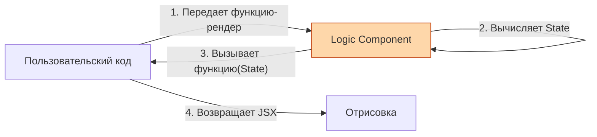

# Render Props

**Render Props** — это паттерн, при котором компонент принимает функцию в качестве пропса (обычно с названием `render` или просто передает функцию как `children`) и вызывает её для рендеринга своего содержимого, передавая в эту функцию своё внутреннее состояние.

## Какую боль мы решаем?
До хуков это был главный (наряду с HOC) способ пошарить сложную stateful-логику между компонентами. Вы пишете компонент, который отслеживает положение мыши или загружает данные, но он *не знает*, как это должно выглядеть. Он отдает данные наружу через функцию, позволяя разработчику самому нарисовать UI.

## Как это работает?
Компонент выполняет расчеты и вместо возврата жестко заданного JSX, он возвращает вызов функции-пропса, аргументами которой служат рассчитанные данные.



### Наглядный пример

**Правильное решение (Паттерн Render Props):**
```tsx
// 1. Компонент, содержащий только логику
class MouseTracker extends React.Component {
  state = { x: 0, y: 0 };

  handleMouseMove = (event) => {
    this.setState("{ x: event.clientX, y: event.clientY }");
  };

  render() {
    return (
      <div style={{ height: '100vh' }} onMouseMove={this.handleMouseMove}>
        {/* Вместо JSX мы вызываем пропс-функцию! */}
        {this.props.render("this.state")}
      </div>
    );
  }
}

// 2. Использование компонента
const App = () => (
  <MouseTracker 
    // Передаем функцию, которая знает, как нарисовать курсор
    render={(mouseState) => (
      <h1>Мышь на координатах: {mouseState.x}, {mouseState.y}</h1>
    )} 
  />
);
```

## Неочевидные нюансы и границы применимости
* **Смерть паттерна (почти):** С появлением кастомных хуков, писать `MouseTracker` как компонент больше не нужно. Проще написать `const {x, y} = useMouse()`. Хуки элегантнее, не добавляют лишних узлов в DOM-дерево и не создают вложенности кода.
* **Callback Hell:** Если вам нужно было использовать 3-4 Render Prop компонента одновременно, разметка превращалась в "стрелочную" пирамиду смерти (ёлочку из функций), которую невозможно читать.
* **Где он выжил:** Паттерн до сих пор актуален там, где компонент управляет сложным внутренним стейтом, который привязан именно к DOM-узлу (например, списки с виртуализацией `react-window` или сложные формы `Formik`). Часто используется современная вариация "Function as Child": `<Component>{(state) => <div>...</div>}</Component>`.
