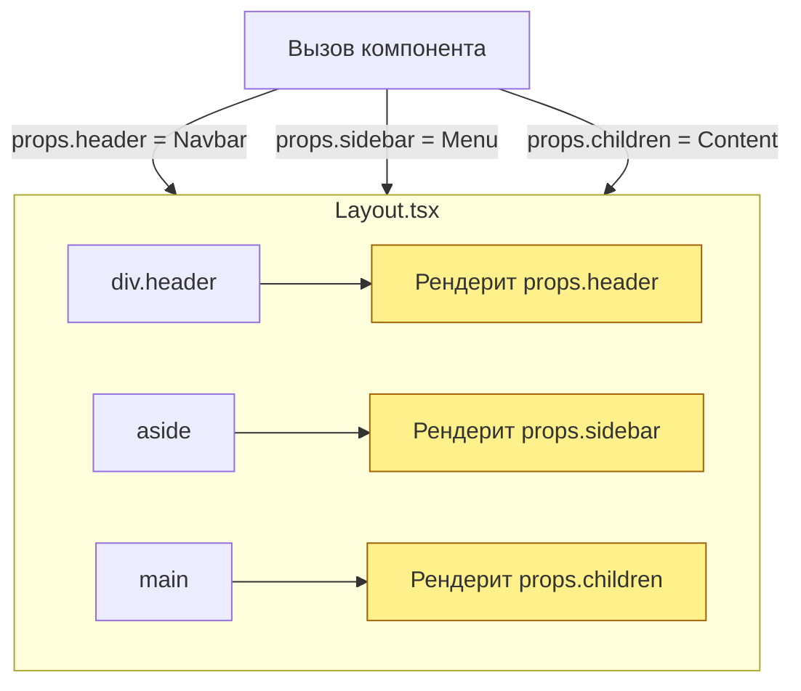

# Slots (Слоты)

**Слоты** — это паттерн композиции, при котором компонент принимает JSX-элементы не только через стандартный пропс `children`, но и через явно именованные пропсы, чтобы расставить этот контент в строго определенные "дырки" (слоты) внутри своей верстки.

## Какую боль мы решаем?
Стандартный пропс `children` отлично подходит, когда у вас есть один контейнер (например, `<Card> {content} </Card>`). Но что, если ваш компонент — это макет страницы (`<Layout>`), которому нужен и Header, и Sidebar, и Footer, и Main Content? Если передать всё это в `children`, компонент `Layout` не поймет, что куда ставить. Придется либо писать Compound Components (что долго), либо использовать слоты.

## Как это работает?
В React нет встроенного тега `<slot>` (в отличие от Vue или Web Components). Слоты реализуются просто: вы передаете React-элементы как обычные пропсы.



### Наглядный пример

**Правильное решение (Использование именованных слотов):**
```tsx
// 1. Создаем компонент со слотами (пропсы header и footer)
const ArticleLayout = ({ header, footer, children }) => {
  return (
    <article className="border rounded shadow-sm">
      {/* Слот 1 */}
      {header && <header className="p-4 border-b bg-gray-50">{header}</header>}
      
      {/* Основной контент */}
      <main className="p-4">{children}</main>
      
      {/* Слот 2 */}
      {footer && <footer className="p-4 border-t text-sm">{footer}</footer>}
    </article>
  );
};

// 2. Использование компонента
const App = () => {
  return (
    <ArticleLayout
      header={<h1 className="text-xl">Заголовок статьи</h1>}
      footer={<button>Поделиться</button>}
    >
      <p>Очень длинный текст статьи...</p>
    </ArticleLayout>
  );
};
```

## Неочевидные нюансы и границы применимости
* **Громоздкий код вызова:** Если в слот нужно передать сложную разметку на 20 строк, код внутри атрибута `header={...}` становится нечитаемым. В таких случаях лучше вынести разметку слота в отдельную переменную или компонент перед вызовом.
* **Передача пропсов изнутри:** Главная проблема слотов в React — компонент `ArticleLayout` не может легко передать свои внутренние данные внутрь переданного слота `header` (в отличие от Scoped Slots во Vue). Если `header` должен знать, открыта ли панель внутри Layout, придется использовать Render Props (передавать функцию: `header={(isOpen) => <Header... />}`) или Context.
* **Именование:** Обычно слоты называют с префиксами `render` (`renderHeader`, `renderFooter`), если они принимают функцию, или как существительные (`header`, `leftIcon`), если принимают готовый React Node.
