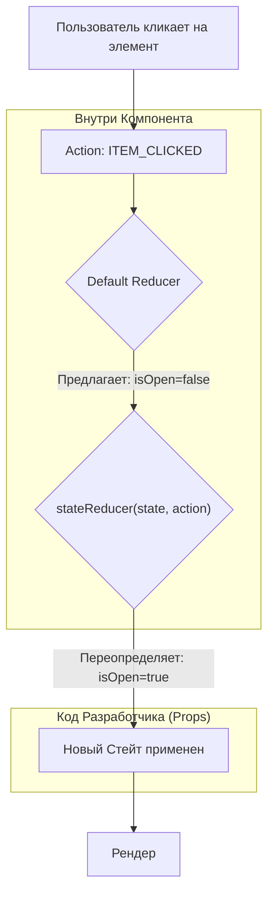

# State Reducer Pattern

**State Reducer** — это продвинутый архитектурный паттерн (популяризированный Kent C. Dodds), который позволяет разработчику (пользователю компонента) вмешиваться во внутреннюю логику обновления состояния библиотеки/компонента (Inversion of Control).

## Какую боль мы решаем?
Вы используете готовую библиотеку (например, сложный `MultiSelect`). По умолчанию, когда вы кликаете на элемент, селект добавляет его в список и **закрывается**. А вам по бизнес-требованиям нужно, чтобы при выборе он оставался открытым, чтобы пользователь мог накликать 5 элементов подряд. 
Обычно вам приходится либо форкать библиотеку, либо писать костыли (пытаться поймать клик и искусственно вызвать метод `open()`). State Reducer позволяет элегантно переопределить эту логику на уровне стейта.

## Как это работает?
Вместо обычного `useState` компонент внутри использует `useReducer`. Компонент принимает пропс `stateReducer` — функцию. Перед тем как обновить свой внутренний стейт, компонент пропускает новое состояние через эту функцию, позволяя программисту снаружи отменить или изменить действие.



### Наглядный пример

**Правильное решение (State Reducer API):**
```tsx
// 1. Использование компонента снаружи
const MyForm = () => {
  // Мы перехватываем внутренние экшены компонента
  const myReducer = (state, action) => {
    switch (action.type) {
      case 'ITEM_CLICKED':
        // Библиотека хочет закрыть селект, но мы принудительно оставляем его открытым
        return { ...action.changes, isOpen: true }; 
      default:
        // Все остальные действия оставляем по умолчанию
        return action.changes;
    }
  };

  return <MultiSelect stateReducer={myReducer} />;
};
```

## Неочевидные нюансы и границы применимости
* **Сложность:** Это самый сложный паттерн в React. Разработчик, использующий ваш компонент, должен понимать концепцию Redux/useReducer, знать структуру вашего внутреннего стейта и типы экшенов.
* **Применимость:** Паттерн нужен только для написания мощных, универсальных open-source библиотек или core-компонентов больших UI-китов (design systems). Писать `stateReducer` для простой кнопки или модалки в бизнес-проекте — это жуткий over-engineering.
* **Экспорт типов:** Вы обязаны экспортировать все типы экшенов (`actionTypes.ITEM_CLICKED`), иначе разработчику придется использовать "магические строки" или догадываться о них через `console.log(action)`.
