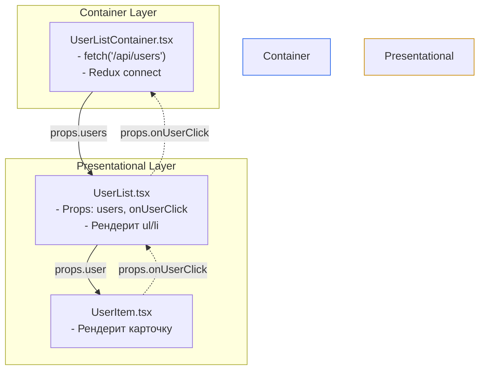

# Container и Presentational Components

**Container / Presentational Pattern** (или Smart / Dumb Components) — это классический архитектурный паттерн разделения ответственности в React-приложениях, популяризированный Дэном Абрамовым.

## Какую боль мы решаем?
Когда вы пишете компонент `<UserList>`, который и делает fetch-запрос к API, и маппит данные, и содержит сложную JSX-верстку с CSS-классами, этот компонент становится невозможным для переиспользования. Если вам нужен точно такой же визуально список на другой странице, но данные для него должны браться не из API, а из LocalStorage, вам придется писать компонент с нуля.

## Как это работает?
Компоненты строго делятся на две категории:
1. **Presentational (Глупые/Визуальные):** Отвечают только за то, *как вещи выглядят*. Они не имеют своего сложного стейта (только UI-стейт типа `isHovered`), не зависят от Redux, API или роутера. Получают данные исключительно через `props`.
2. **Container (Умные/Логические):** Отвечают за то, *как вещи работают*. Они делают запросы, подписаны на стор, и рендерят внутри себя Presentational-компоненты, передавая им данные.



### Наглядный пример

**Правильное решение:**
```tsx
// 1. Презентационный (Dumb)
// Идеально тестируется (просто передай mock props) и может лежать в Storybook
const UserListUI = ({ users, isLoading, onRetry }) => {
  if (isLoading) return <Spinner />;
  return (
    <ul>
      {users.map("u => <li key={u.id}>{u.name}</li>")}
    </ul>
  );
};

// 2. Контейнер (Smart)
const UserListContainer = () => {
  const { data, loading, error, retry } = useQuery("'/users'");
  
  if (error) return <ErrorState onRetry={retry} />;
  return <UserListUI users={data} isLoading={loading} />;
};
```

## Неочевидные нюансы и границы применимости
* **"Устаревание" паттерна:** Сам Дэн Абрамов заявил, что с появлением хуков в 2019 году этот паттерн стал менее актуальным. Теперь нет нужды создавать отдельный компонент-контейнер. Логику (fetch, Redux) можно вынести в кастомный хук (`useUsers`), а сам компонент оставить единым.
* **Исключения:** Паттерн всё ещё очень полезен, когда вы разрабатываете UI-Kit компании (там лежат только dumb-компоненты), а продуктовые команды пишут умные компоненты, которые используют этот UI-Kit.
* **Слепой догматизм:** Не нужно разбивать *каждую* кнопку на `ButtonContainer` и `ButtonUI`. Применяйте разделение только там, где компонент начинает "толстеть" от логики.
