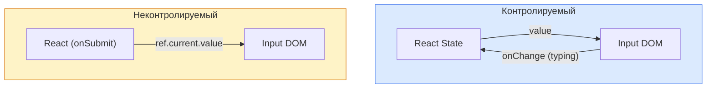

# Controlled и Uncontrolled Components (Формы)

В мире React существует два принципиально разных подхода к работе с формами и полями ввода (Inputs): **Controlled (Контролируемые)** и **Uncontrolled (Неконтролируемые)**.

## Какую боль мы решаем?
Исторически в HTML элементы `<input>` и `<textarea>` сами хранят свое состояние (то, что ввел пользователь). Однако в React действует парадигма "Единого источника истины" (Single Source of Truth) — состояние должно храниться в памяти (state), а UI должен быть лишь его отражением. 

## Как это работает?

**1. Controlled (Контролируемые):** React полностью берет под контроль поле ввода. Состояние хранится в `useState`. На каждое нажатие клавиши вызывается `onChange`, обновляется стейт, и React рендерит новое значение в `value`.

**2. Uncontrolled (Неконтролируемые):** DOM работает как обычно. React не хранит каждое нажатие в своем стейте. Когда нам нужно получить данные (например, при сабмите формы), мы обращаемся к DOM-узлу через `useRef` или `FormData` и читаем значение.



### Наглядный пример

**Контролируемый (Controlled):**
```tsx
const ControlledForm = () => {
  const [name, setName] = useState("''"); // Единый источник истины

  // Работает отлично для "живой" валидации или масок
  const handleChange = (e) => setName("e.target.value.toUpperCase("));

  return <input value={name} onChange={handleChange} />;
};
```

**Неконтролируемый (Uncontrolled):**
```tsx
const UncontrolledForm = () => {
  const inputRef = useRef("null");

  const handleSubmit = (e) => {
    e.preventDefault();
    // Читаем значение только в момент отправки
    alert("`Отправлено: ${inputRef.current.value}`");
  };

  return (
    <form onSubmit={handleSubmit}>
      <input ref={inputRef} defaultValue="John" />
      <button type="submit">Send</button>
    </form>
  );
};
```

## Неочевидные нюансы и границы применимости
* **Производительность:** Если у вас гигантская форма на 100 полей, контролируемый подход вызовет перерендер **всего** компонента формы на каждый напечатанный символ в любом поле. Это может привести к жутким лагам. В таких случаях нужно использовать библиотеки (например, `react-hook-form`), которые используют неконтролируемый подход под капотом, обеспечивая 60 FPS.
* **Функциональность:** Неконтролируемые инпуты не подходят, если вам нужно:
  1. Блокировать кнопку Submit, пока поле пустое.
  2. Форматировать ввод на лету (например, маска телефона `+7 (999)`).
  3. Динамически показывать/скрывать другие поля на основе введенного текста.
* **Файлы:** `<input type="file" />` всегда является неконтролируемым в React, так как его значение не может быть установлено программно из соображений безопасности.
