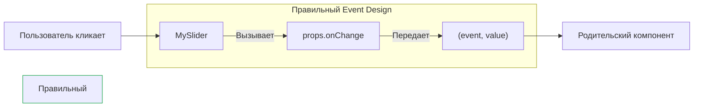

# Events Design (Проектирование событий)

**Events Design** — это набор архитектурных правил о том, как компоненты должны сообщать внешнему миру о том, что внутри них что-то произошло (клик, изменение стейта, ошибка).

## Какую боль мы решаем?
Когда проект пишется без стандартов, пропсы компонентов превращаются в хаос. У одной кнопки событие называется `action`, у инпута — `updateValue`, у модалки — `closeHandler`. Еще хуже, когда коллбеки возвращают непредсказуемые аргументы: один компонент возвращает строку, другой — синтетическое событие, третий — объект `{ value, index }`. Использовать такую библиотеку компонентов невозможно без постоянного заглядывания в исходники.

## Как это работает?
В React де-факто стандартом является подражание нативному DOM API. События должны называться с префиксом `on*` и передавать стандартизированные объекты (или хотя бы ожидаемые примитивы).



### Наглядный пример

**Антипаттерн (Хаос именований и сигнатур):**
```tsx
// ❌ Названия не стандартизированы, не ясно, что возвращается
<SearchInput 
  changeText={(text) => console.log(text)}
  submitForm={(event, text) => api.search(text)}
/>
```

**Правильное решение (DOM-подобный API):**
```tsx
// ✅ Названия on[Action], всегда первым аргументом идет Event (если есть)
<SearchInput 
  onChange={(event) => console.log(event.target.value)}
  onSubmit={(event, { value }) => api.search(value)}
/>
```

## Неочевидные нюансы и границы применимости
* **Префикс `on`:** Всегда начинайте пропсы событий с `on` (`onClick`, `onValueChange`, `onModalClose`). Внутри компонента функции-обработчики называйте с `handle` (`handleClick`, `handleSubmit`).
* **Сигнатура (Аргументы):** Если ваш компонент является оберткой над нативным элементом (например, кастомный `<Input />`), он **обязан** возвращать нативный объект события `React.ChangeEvent` первым аргументом. Иначе библиотеки вроде `react-hook-form` сломаются при работе с вашим компонентом.
* **Дополнительные данные:** Часто нативного ивента мало. Если это `<List item={item} onClick={...} />`, родителю при клике нужен не просто DOM-event, а сам `item`. Правильный паттерн: передавать event первым аргументом, а кастомную нагрузку (payload) — вторым. `onClick={(e, item) => ...}`.
* **Дефолтные функции:** Если компонент вызывает `props.onClick()`, он упадет, если пропс не передан. Используйте опциональную цепочку `props.onClick?.(e)`.
