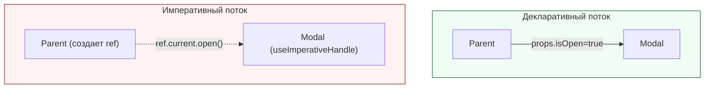

# Imperative API (Императивный API)

**Imperative API** — это паттерн, позволяющий родительскому компоненту напрямую вызывать методы дочернего компонента, нарушая стандартный декларативный поток данных (props сверху вниз). В React это реализуется через связку `forwardRef` и хука `useImperativeHandle`.

## Какую боль мы решаем?
React учит нас мыслить декларативно: "Если нужен фокус, передай пропс `autoFocus={true}`". Но иногда это не работает. Как заставить видеоплеер сделать `.pause()` по клику на кнопку вне этого плеера? Как принудительно заставить сложную форму сбросить внутренний стейт без пересоздания компонента? Передавать пропс `shouldReset={true}`, а потом как-то сбрасывать его обратно — это ужасный "костыль". Тут нужен прямой императивный вызов.

## Как это работает?
Родитель создает `ref` и передает его ребенку. Ребенок (через `forwardRef`) перехватывает этот `ref` и с помощью `useImperativeHandle` "навешивает" на него объект с функциями. Теперь родитель может вызвать `ref.current.myFunction()`.



### Наглядный пример

**Правильное решение (Сброс формы):**
```tsx
// 1. Дочерний компонент: раскрывает наружу метод reset
const CustomForm = forwardRef((props, ref) => {
  const [text, setText] = useState('');

  useImperativeHandle(ref, () => ({
    // Этот метод будет доступен родителю
    resetForm: () => setText('') 
  }));

  return <input value={text} onChange={e => setText(e.target.value)} />;
});

// 2. Родительский компонент
const App = () => {
  const formRef = useRef(null);

  const handleGlobalReset = () => {
    // Прямой императивный вызов метода ребенка!
    formRef.current?.resetForm(); 
  };

  return (
    <div>
      <CustomForm ref={formRef} />
      <button onClick={handleGlobalReset}>Сбросить всё</button>
    </div>
  );
};
```

## Неочевидные нюансы и границы применимости
* **"Code Smell" (Душок кода):** По документации React, императивный код следует использовать **только** в крайних случаях: управление фокусом, выделение текста, интеграция со сторонними DOM-библиотеками (jQuery, D3) или медиа-элементами (`<video>`). Использование Imperative API для передачи данных — это грубейшая архитектурная ошибка.
* **Жесткая связность (Tight Coupling):** Родитель начинает слишком много знать о внутренностях ребенка. Если ребенок переименует метод `resetForm` в `clear`, приложение упадет в рантайме.
* **Тяжело тестировать:** Декларативные компоненты тестируются легко (проверил пропсы = проверил рендер). Для императивных нужно мокать рефы и проверять вызовы функций.
