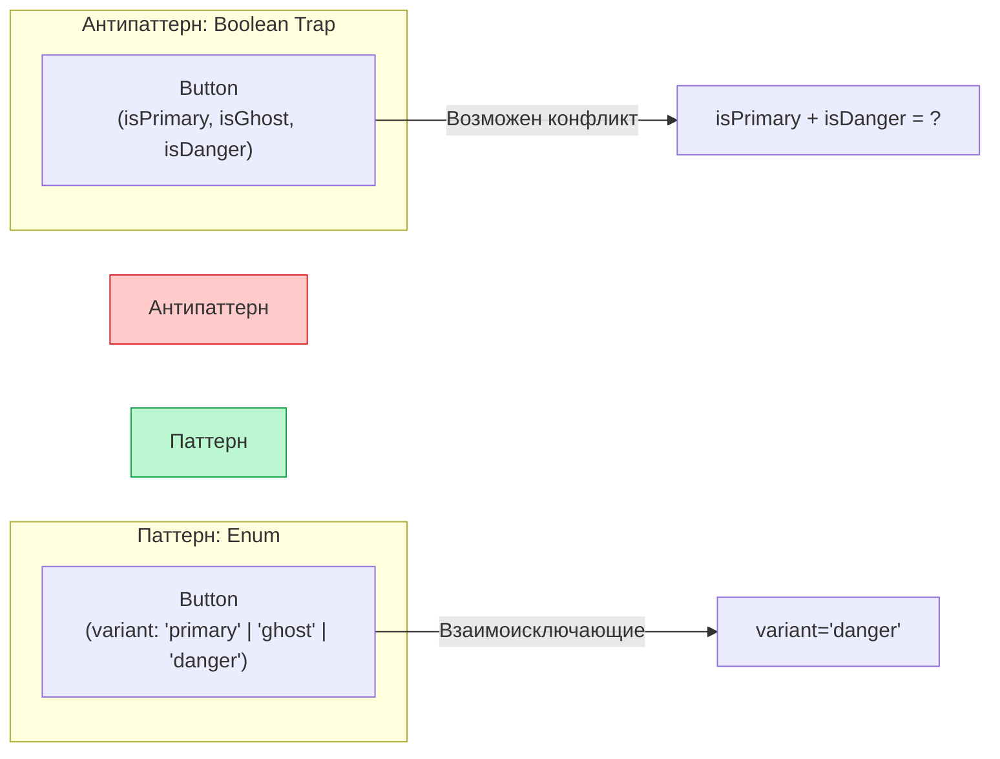

# Props Design (Проектирование пропсов)

**Props Design** — это набор инженерных практик по созданию чистого, предсказуемого и масштабируемого API для компонентов. От того, как вы спроектируете пропсы, зависит, будут ли ваши коллеги (или вы сами через месяц) ненавидеть этот компонент.

## Какую боль мы решаем?
Когда компонент разрастается, разработчики часто добавляют новые пропсы "на лету". Это приводит к двум классическим проблемам:
1. **Apropcalypse:** У компонента 35+ пропсов.
2. **Boolean Trap (Ловушка булевых флагов):** Кнопка имеет пропсы `isPrimary`, `isSecondary`, `isDanger`. Что будет, если передать `<Button isPrimary isDanger />`? Какой стиль победит? Это неочевидно.

## Как это работает?
Вместо множества флагов используются Enum'ы (строковые литералы). Вместо плоских списков из 20 пропсов — группировка в объекты (если данные логически связаны) или использование паттерна "Композиция".



### Наглядный пример

**Антипаттерн (Boolean Trap и плоский список):**
```tsx
<UserProfile 
  isOnline={true}
  isBanned={false}
  avatarUrl="/img.png"
  userName="John"
  userAge={30}
  onUserClick={() => {}}
  onAvatarClick={() => {}}
/>
```

**Правильное решение (Enums и Группировка):**
```tsx
<UserProfile 
  // 1. Enum вместо Boolean (пользователь может быть только в одном статусе)
  status="online" // 'online' | 'offline' | 'banned'
  
  // 2. Группировка связанных данных (если они всегда ходят вместе)
  user={{ name: "John", age: 30, avatarUrl: "/img.png" }}
  
  // 3. Явные события
  onClick={() => {}}
/>
```

## Неочевидные нюансы и границы применимости
* **Плоские пропсы vs Объекты:** Если вы передаете объект `user={{...}}`, помните, что каждый рендер родителя будет создавать **новую ссылку** на этот объект. Если `UserProfile` обернут в `React.memo`, он всё равно будет перерендериваться! Плоские примитивы (`name`, `age`) решают проблему ссылочной идентичности, но раздувают API. Используйте `useMemo` для объектов.
* **Spread-атрибуты (`{...rest}`):** Если ваш компонент является оберткой над нативным HTML-элементом, всегда прокидывайте `...rest` пропсы. Если разработчик захочет добавить `aria-label` или `data-testid` на вашу кнопку, а вы не предусмотрели `...rest`, ему придется вносить изменения в исходный код кнопки.
* **Дефолтные значения:** Обозначайте обязательность. Опциональные пропсы должны иметь дефолтное значение прямо при деструктуризации: `const { variant = 'primary' } = props`. Это надежнее, чем использовать устаревший `defaultProps`.
