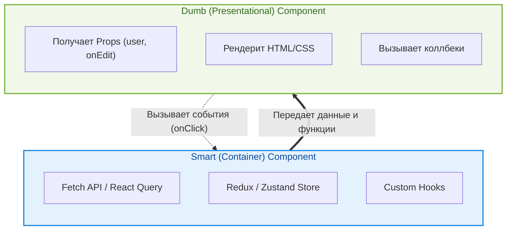

Разделение компонентов на "Умные" (Smart / Container) и "Глупые" (Dumb / Presentational) — это классический паттерн проектирования в React, предложенный Дэном Абрамовым. Суть паттерна в строгом разделении логики получения/управления данными и логики их визуального отображения.

## Проблема (Боль)

Когда компонент сам запрашивает данные, управляет сложным состоянием и при этом отвечает за сложную верстку, он становится:
1. **Непереиспользуемым:** Вы не можете взять этот компонент и показать в нем другие данные.
2. **Сложным в тестировании:** Чтобы протестировать верстку, вам придется мокать API, стор и кучу зависимостей.
3. **Хрупким:** Изменение дизайна может случайно сломать бизнес-логику, и наоборот.

### Антипаттерн: Компонент, знающий слишком много
```tsx
// ❌ Плохо: логика и отображение смешаны в кашу
export function UserProfile() {
  const [user, setUser] = useState(null);
  const [isEditing, setIsEditing] = useState(false);

  useEffect(() => {
    fetch('/api/me').then(res => res.json()).then(setUser);
  }, []);

  if (!user) return <div className="spinner">Загрузка...</div>;

  return (
    <div className="profile-card bg-white p-4 rounded-lg shadow-md">
      {/* Глубоко вложенная сложная верстка */}
      
      <h2 className="text-xl font-bold">{user.name}</h2>
      
      <button 
        onClick={() => setIsEditing(!isEditing)}
        className="bg-blue-500 text-white px-4 py-2 mt-4"
      >
        {isEditing ? 'Отмена' : 'Редактировать'}
      </button>
      
      {/* ... еще сотня строк верстки ... */}
    </div>
  );
}
```

## Решение: Разделение ответственности

Мы разбиваем один компонент на два:
1. **Container (Smart):** Заботится о *том, как вещи работают*. Делает запросы, подписывается на стор, передает данные вниз через props. Не содержит своих DOM-элементов (только обертки).
2. **Presentational (Dumb):** Заботится о *том, как вещи выглядят*. Получает данные исключительно через props. Не знает о сети, сторе или бизнес-сущностях верхнего уровня.



### Как это выглядит (Хороший пример)

**1. Dumb Component (чистый UI):**
```tsx
// ✅ Отвечает только за внешний вид. Идеально ложится в Storybook.
export function UserProfileCard({ user, isEditing, onEditToggle }) {
  return (
    <div className="profile-card bg-white p-4 rounded-lg shadow-md">
      
      <h2 className="text-xl font-bold">{user.name}</h2>
      
      <button 
        onClick={onEditToggle}
        className="bg-blue-500 text-white px-4 py-2 mt-4"
      >
        {isEditing ? 'Отмена' : 'Редактировать'}
      </button>
    </div>
  );
}
```

**2. Smart Component (Связующее звено):**
```tsx
// ✅ Отвечает за логику. Рендерит Dumb компонент.
import { useCurrentUser } from '@/hooks/useCurrentUser';

export function UserProfileContainer() {
  const { data: user, isLoading } = useCurrentUser();
  const [isEditing, setIsEditing] = useState(false);

  if (isLoading) return <div>Загрузка...</div>;

  return (
    <UserProfileCard 
      user={user} 
      isEditing={isEditing} 
      onEditToggle={() => setIsEditing(!isEditing)} 
    />
  );
}
```

## Трейдоффы и границы применимости

### Когда использовать ✅
- **Сложные UI-элементы:** Карточки, формы, таблицы, которые вы хотите переиспользовать в разных местах приложения, возможно, с разными источниками данных.
- **Работа со Storybook:** Глупые компоненты идеально подходят для изоляции UI и тестирования всех состояний визуально.
- **Разделение труда в команде:** Верстальщик может пилить `Dumb` компоненты, пока Frontend Engineer пишет логику в `Smart`.

### Когда НЕ использовать ❌
- **Маленькие проекты:** Для простейшего приложения это будет оверинжинирингом (слишком много файлов и пропсов).
- **В эпоху Hooks:** С появлением кастомных хуков (`useHooks`), часть логики стала легко извлекаться. Часто достаточно просто вынести сложную логику в `useUserProfile()`, оставив один компонент. Сам Дэн Абрамов признал, что с приходом хуков этот паттерн стал менее догматичным.

### Неочевидные нюансы
- **Проблема Props Drilling:** Если у вас глубокое дерево глупых компонентов, вам придется прокидывать пропсы (типа `onItemClick`) через множество слоев, которые в них не нуждаются.
- **Альтернатива - Слоты / Composition:** Вместо жесткого Smart/Dumb разделения иногда лучше использовать композицию: `<Layout sidebar={<SmartSidebar />} content={<SmartContent />} />`. Это решает проблему props drilling.
