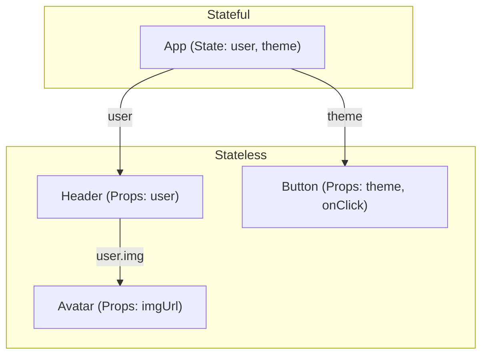

# Stateful и Stateless Components

**Stateful (с состоянием)** и **Stateless (без состояния)** — это базовая классификация компонентов в React, определяющая, хранит ли компонент какие-либо данные внутри себя, или его внешний вид зависит исключительно от входящих параметров (props).

## Какую боль мы решаем?
Когда каждый компонент на странице сам управляет своим состоянием, приложение превращается в хаос. Если `<Header>` сам хранит состояние корзины, а `<Sidebar>` тоже нуждается в этих данных, синхронизировать их становится почти невозможно. Разделение позволяет выстроить предсказуемую архитектуру: "Умные" родители (Stateful) управляют данными, "Глупые" дети (Stateless) просто их отображают.

## Как это работает?
* **Stateless (Чистые компоненты):** Похожи на чистые математические функции. Для одних и тех же `props` они всегда отрендерят один и тот же результат. У них нет `useState`, нет сложных сайд-эффектов. Они легко тестируются и идеально переиспользуются.
* **Stateful:** Хранят внутри себя `useState`, `useReducer` или делают запросы `useEffect`. Они являются "источником истины" (Source of Truth) для своих дочерних элементов.



### Наглядный пример

**Lifting State Up (Поднятие состояния):**
Часто два Stateless компонента должны взаимодействовать. В этом случае их состояние "поднимается" к ближайшему общему родителю (Stateful).

```tsx
// 1. Stateless: Только рендерит, ничего не знает о логике
const Input = ({ value, onChange }) => (
  <input value={value} onChange={(e) => onChange(e.target.value)} />
);

// 2. Stateless: Только рендерит
const TextDisplay = ({ text }) => <div>Вы ввели: {text}</div>;

// 3. Stateful: Владеет состоянием и координирует детей
const FormWrapper = () => {
  const [text, setText] = useState(''); // Состояние здесь!

  return (
    <div>
      <Input value={text} onChange={setText} />
      <TextDisplay text={text} />
    </div>
  );
};
```

## Неочевидные нюансы и границы применимости
* **Локальный UI-стейт:** Компонент может считаться "преимущественно Stateless" в контексте бизнес-логики, даже если внутри него есть крошечный `useState(false)` для управления состоянием: открыт/закрыт дропдаун или находится ли кнопка в состоянии `isHovered`. Это UI-стейт, который не влияет на бизнес-данные.
* **Производительность:** Stateful компоненты — это триггеры ререндеров. Когда стейт меняется, рендерится сам Stateful компонент и ВСЁ его дочернее дерево Stateless компонентов. Если стейт часто меняется (например, набор текста), его нужно опускать как можно ниже по дереву, чтобы не рендерить всю страницу.
* **Сложность:** 100% Stateless архитектура (когда весь стейт живет только в Redux/Zustand, а все компоненты — глупые) приводит к огромному количеству бойлерплейта. Держите UI-состояние локальным.
