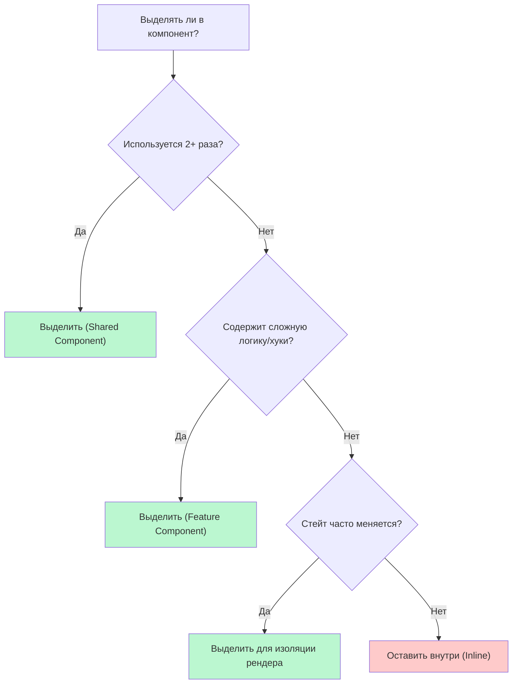

# Границы компонентов (Component Boundaries)

**Границы компонентов** — это концептуальные и физические линии разреза, по которым цельный пользовательский интерфейс дробится на отдельные файлы и функции. Это ответ на вечный вопрос: "Должен ли я вынести этот кусок кода в отдельный компонент?"

## Какую боль мы решаем?
* **Компоненты-Боги:** Файлы на 1000 строк кода, где смешаны header, sidebar, таблица и пагинация. Их невозможно читать, рефакторить, а при малейшем изменении стейта перерендеривается вся страница.
* **Преждевременная фрагментация:** Обратная крайность. Когда разработчик выносит каждый `<div>` с текстом в отдельный файл `TitleComponent.tsx`, создавая адскую вложенность. Чтобы понять, как работает одна карточка, нужно открыть 15 файлов.

## Как это работает?
Определить границу компонента помогают три главных критерия:
1. **Переиспользуемость (Reusability):** Встречается ли этот кусок UI больше одного раза в проекте?
2. **Ответственность (Single Responsibility):** Решает ли этот кусок только одну логическую задачу?
3. **Оптимизация рендеров (Performance):** Содержит ли этот кусок часто меняющийся стейт, который заставляет тормозить всё остальное?



### Наглядный пример

**Изоляция рендера (Performance Boundary):**
Представьте страницу с тяжелым графиком и формой ввода текста.

**Антипаттерн:**
```tsx
const Dashboard = () => {
  const [text, setText] = useState(''); // Стейт ввода
  
  return (
    <div>
      {/* При вводе каждого символа график рендерится заново! */}
      <input value={text} onChange={e => setText(e.target.value)} />
      <HeavyChart /> 
    </div>
  );
}
```

**Правильно (Проведение границы):**
```tsx
// Выносим ввод в отдельный компонент со СВОИМ локальным стейтом
const SearchInput = () => {
  const [text, setText] = useState('');
  return <input value={text} onChange={e => setText(e.target.value)} />;
}

const Dashboard = () => {
  return (
    <div>
      <SearchInput /> {/* Рендерится только он */}
      <HeavyChart /> {/* Больше не страдает */}
    </div>
  );
}
```

## Неочевидные нюансы и границы применимости
* **Связность данных (Coupling):** Если вы выделяете компонент, и вам приходится передавать в него 15 пропсов от родителя, вы провели границу неправильно. Скорее всего, вы разрезали логически неразрывный блок. Верните его обратно или используйте `children` композицию.
* **Правило 3-х раз:** Не выносите компонент в папку `shared/components`, если вы использовали его только 2 раза. Часто вторая реализация слегка отличается, и вы начинаете добавлять костыльные пропсы. Подождите третьего юзкейса, тогда паттерн станет очевидным.
* **Чтение кода:** Если компонент превышает 200-300 строк, это первый звоночек (code smell), что границы размыты, и пора выделять логические под-компоненты.
