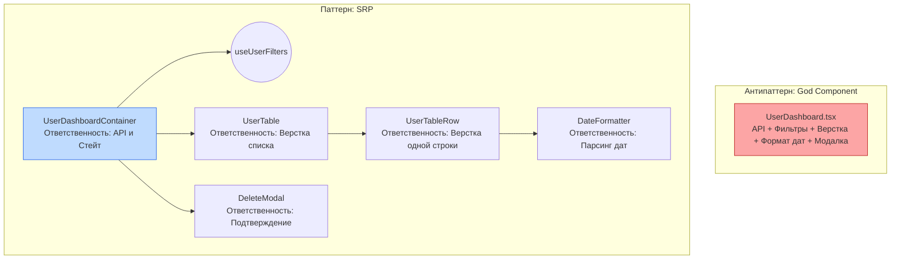

# Ответственность компонента (Single Responsibility)

Принцип единой ответственности (SRP из SOLID) в мире React гласит: **один компонент должен иметь только одну причину для изменения**. Он должен решать только одну конкретную задачу (либо загружать данные, либо рендерить список, либо форматировать дату).

## Какую боль мы решаем?
Разработчики часто создают "Компоненты-Боги" (God Components). Например, компонент `<UserDashboard>`:
1. Делает fetch-запрос к API.
2. Сортирует и фильтрует массив пользователей.
3. Содержит сложную JSX-верстку таблицы с CSS-классами.
4. Внутри таблицы имеет инлайн-логику форматирования даты (`Intl.DateTimeFormat`).
5. Управляет модалкой "Удалить пользователя".

Любое изменение требований (поменять цвет таблицы, изменить формат даты или переписать API) заставит вас лезть в этот файл. Он становится хрупким, конфликты слияния в Git возникают постоянно.

## Как это работает?
Вы берете "Бога" и дробите его по зонам ответственности, передавая данные через пропсы.

### Наглядный пример

**Правильное выделение ответственности:**
Если вам нужно отрендерить аватар пользователя, который при клике открывает меню, не нужно всё писать в одном файле.
1. `<Avatar src={url} />` — ответственность: нарисовать круглую картинку и fallback (если картинка битая).
2. `<Dropdown overlay={menu}>{children}</Dropdown>` — ответственность: позиционирование всплывающего окна и клики вне элемента (click-outside).
3. `<UserMenu user={user} />` (Предметный компонент) — ответственность: соединить `Avatar` и `Dropdown`, передав бизнес-данные юзера.

## Неочевидные нюансы и границы применимости
* **Симптом "Слепой верности":** Строгое следование SRP может привести к тому, что для рендера одной карточки вам придется создать 10 файлов (`CardContainer`, `CardUI`, `CardTitle`, `CardDate`...). Если компонент маленький (менее 100-150 строк) и легко читается, оставьте его в покое. SRP нужен для борьбы со сложностью, а не ради создания новых папок.
* **Признаки нарушения SRP:**
  1. Слово "И" в названии (`UserListAndFilters`).
  2. В компоненте есть несколько эффектов (`useEffect`), которые никак не связаны друг с другом.
  3. Компонент принимает слишком много не связанных друг с другом пропсов.
