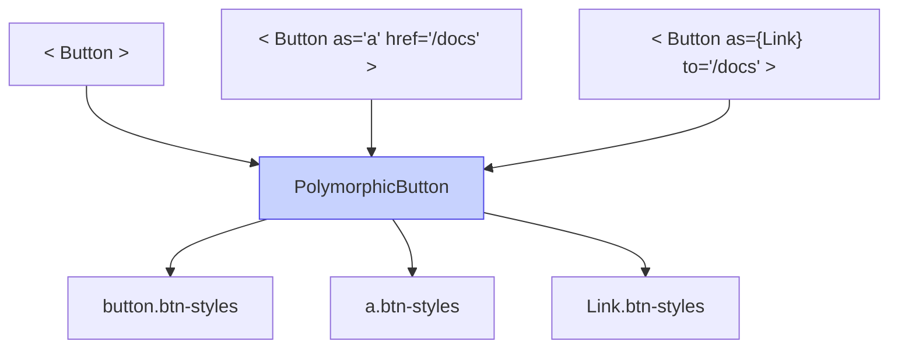

# Полиморфные компоненты

**Полиморфный компонент** — это компонент, который способен динамически изменять свой корневой HTML-тег (или оборачиваемый React-компонент) с помощью специального пропса (обычно `as` или `component`), сохраняя при этом все свои внутренние стили и логику поведения.

## Какую боль мы решаем?
У вас есть дизайн-система. Вы создали идеальную кнопку `<Button>` с красивыми ховерами, тенями и состояниями загрузки. Внезапно по дизайну эту же самую "кнопку" нужно поставить в навигацию. Но семантически в навигации должна быть ссылка `<a>` с атрибутом `href` (для SEO и работы React Router). 
Без полиморфизма вам придется либо нарушать HTML-семантику (используя `<button onClick={() => navigate('/home')}>`), либо создавать отдельный компонент `<LinkButton>`, дублируя все CSS-классы и логику первой кнопки.

## Как это работает?
Компонент принимает пропс `as`, который указывает, какой тег отрендерить. Компонент использует заглавную букву для этого пропса (чтобы React понял, что это компонент, а не HTML-атрибут) и распыляет на него все остальные пропсы.



### Наглядный пример

**Правильное решение (Базовый Полиморфизм):**
```tsx
// 1. Создаем полиморфный компонент (упрощенная версия без сложных TS типов)
const Button = ({ as: Component = 'button', className, children, ...rest }) => {
  // Классы и логика живут в одном месте
  const baseClasses = "px-4 py-2 font-bold rounded shadow-md hover:bg-blue-600";
  
  // Рендерим динамический тег!
  return (
    <Component className={`${baseClasses} ${className}`} {...rest}>
      {children}
    </Component>
  );
};

// 2. Использование
const App = () => (
  <nav>
    {/* Стандартная кнопка (отрендерится как <button type="submit">) */}
    <Button type="submit">Отправить</Button>

    {/* Ссылка (отрендерится как <a href="/docs">) */}
    <Button as="a" href="/docs">Документация</Button>
    
    {/* Сторонний компонент роутера */}
    <Button as={ReactRouterLink} to="/home">На главную</Button>
  </nav>
);
```

## Неочевидные нюансы и границы применимости
* **Ад типизации (TypeScript):** Написать полиморфный компонент на чистом JS легко. Типизировать его в TypeScript — это кошмар уровня Senior. Нужно, чтобы если `as="a"`, TS разрешал пропс `href`, а если `as="button"`, TS запрещал `href` и требовал `type`. Используются дженерики и утилиты типа `ComponentPropsWithoutRef<E>`.
* **Accessibility (a11y) риски:** Давая разработчику власть менять теги, вы рискуете тем, что он сделает `as="div"` для интерактивного элемента, потеряв возможность фокуса по `Tab` и поддержку скринридеров. Полиморфными делают только семантически похожие элементы (Button -> Link) или текстовые блоки (Text `as="h1" | "h2" | "p"`).
