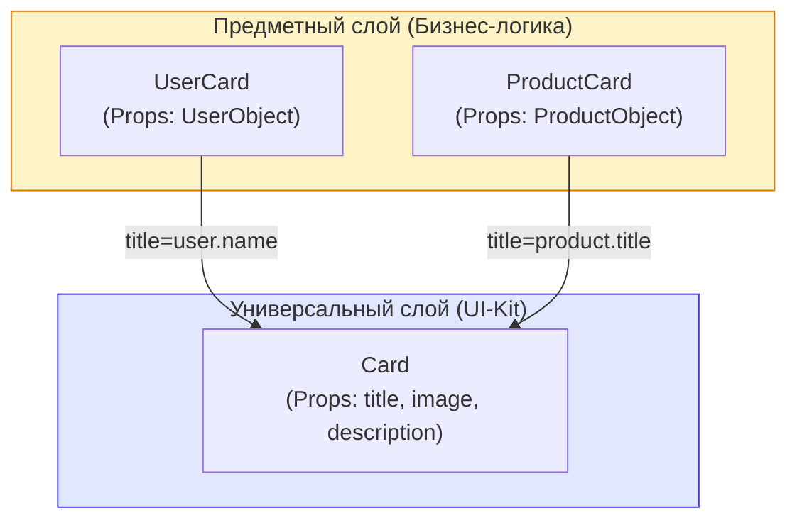

# Универсальные и предметные компоненты

Масштабируемая архитектура React-приложений строго разделяет компоненты на два логических слоя: **Универсальные (Generic / UI-Kit)** и **Предметные (Domain / Feature)**.

## Какую боль мы решаем?
Разработчик создает компонент `Card` (карточка) и сразу пишет в нем: `title={user.firstName} avatar={user.avatarUrl}`. 
Через неделю нужно отрендерить карточку Товара (`product.name`, `product.image`). Разработчик пытается переиспользовать `Card`, но она намертво прибита гвоздями к структуре объекта `user`. Приходится добавлять проверки: `title={user ? user.firstName : product.name}`. Компонент превращается в спагетти-код из-за жесткого связывания UI с предметной областью (бизнес-моделями).

## Как это работает?

1. **Универсальные (UI-Kit):** Ничего не знают о вашем бизнесе. Они оперируют абстрактными терминами: `title`, `imageUrl`, `onClick`, `isOpen`. Лежат в папке `src/components/ui`.
2. **Предметные (Domain):** Знают о бизнесе всё (Модели: Пользователь, Товар, Заказ). Они принимают бизнес-объекты (`user`, `order`), извлекают из них нужные поля и передают их в Универсальные компоненты. Лежат рядом с фичами `src/features/users/components`.



### Наглядный пример

**Антипаттерн (Предметная логика протекла в UI):**
```tsx
// ❌ Грязный UI-компонент, который знает про API моделей
const Avatar = ({ user }) => {
  // А что если мне нужно отрендерить логотип компании, а не юзера?
  const initials = user.firstName[0] + user.lastName[0]; 
  return ;
};
```

**Правильное решение (Разделение слоев):**
```tsx
// 1. Универсальный компонент (UI-Kit). Максимально тупой и гибкий.
const Avatar = ({ src, alt, fallbackText }) => {
  return ;
};

// 2. Предметный компонент (Domain). Выступает адаптером-оберткой.
const UserAvatar = ({ user }) => {
  const initials = user.firstName[0] + user.lastName[0];
  // Маппит бизнес-модель на абстрактный UI
  return <Avatar src={user.avatarUrl} alt={user.fullName} fallbackText={initials} />;
};
```

## Неочевидные нюансы и границы применимости
* **Дублирование кода (Boilerplate):** Разделение неизбежно приводит к созданию множества "тонких" оберток, которые делают только одно — прокидывают пропсы (адаптеры). Для маленьких проектов это излишний оверхед. Начинайте писать универсальные компоненты только тогда, когда вам действительно понадобилось использовать визуал в разных бизнес-контекстах.
* **Импорты:** Архитектурное правило Линтера: Универсальные компоненты (из UI-kit) **не имеют права** импортировать в себя Предметные компоненты. Слой UI должен быть абсолютно независимым (чистым). Предметные компоненты могут импортировать Универсальные.
* **Именование:** В названии предметных компонентов всегда должно фигурировать бизнес-понятие (`UserCard`, `OrderSummary`), в универсальных — только визуальное (`Card`, `Accordion`, `Panel`).
