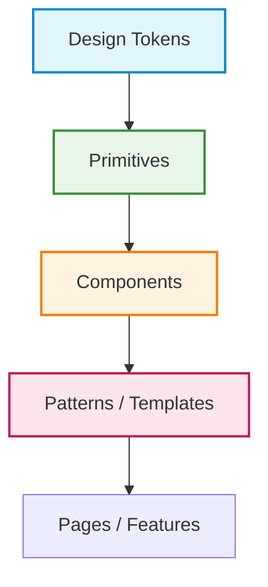

# Design System и UI Platform

Дизайн-система — это больше, чем UI Kit. Это единый инженерный фундамент, который позволяет продуктовым командам собирать интерфейсы из готовых, протестированных и визуально консистентных кубиков, не задумываясь о том, какой должен быть `border-radius` или как ведет себя селект при открытии.

## Какую боль мы решаем?
Когда продукт растет, количество кнопок, дропдаунов и цветов начинает плодиться экспоненциально. Дизайнеры рисуют разные отступы, разработчики пишут разные обертки над одними и теми же компонентами. Результат: 
- Дизайн ревью занимает часы.
- В коде 15 разных реализаций кнопки.
- Изменение корпоративного цвета требует поиска `replace` по всему проекту.

Дизайн-система, построенная как UI-платформа, решает эту проблему, предлагая строгую иерархию абстракций: от дизайн-токенов до сложных паттернов.



## Как это работает?
Вместо того чтобы хардкодить стили в компонентах, UI Platform предоставляет:
1. **Токены (Design Tokens)**: Базовые единицы (цвета, шрифты, отступы).
2. **Систему компонентов**: От изолированных примитивов (`Button`, `Icon`) до композитных (`DateRangePicker`).
3. **Темизацию**: Механизм переключения светлой/темной темы или адаптации под разные бренды (White-label).
4. **Инструментарий**: Storybook для изоляции, автоматическая генерация типов из Figma.

## Антипаттерн vs Правильное решение

❌ **Антипаттерн: Использование магических чисел и хардкода стилей на местах.**
```tsx
// Плохо: значения разбросаны, их трудно обновлять, нет единого словаря.
function DangerButton() {
  return <button style={{ backgroundColor: '#ff4d4f', padding: '12px 24px', borderRadius: '4px' }}>Удалить</button>;
}
```

✅ **Правильное решение: Использование дизайн-токенов и строгой системы компонентов.**
```tsx
// Хорошо: компонент использует семантические пропсы, стили зашиты внутри платформы.
import { Button } from '@ui-platform/core';

function DangerButton() {
  return <Button variant="danger" size="large">Удалить</Button>;
}
```

## Скрытые трейдоффы и границы применимости
- **Оверхед на старте:** Создание полноценной дизайн-системы с токенами, документацией и процессами CI/CD требует огромных вложений. Для MVP или стартапа лучше взять готовое решение (MUI, Radix, AntD).
- **Жесткость системы:** Разработчики могут жаловаться, что им "просто нужно сделать кнопку на 2px больше", а дизайн-система этого не позволяет. Это решается правильным Governance (процессом внесения изменений) и "точками побега" (escape hatches), но баланс найти сложно.
- **Ломается на "особых" страницах:** Промо-лендинги и маркетинговые страницы часто требуют уникального визуала, который ломает строгие правила дизайн-системы. Дизайн-систему лучше ограничивать продуктовым (app) интерфейсом.
