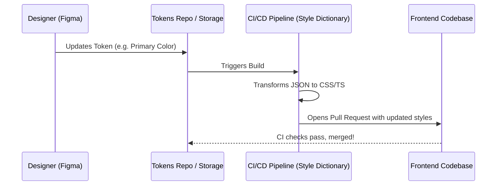

# Design to Code

В классическом процессе взаимодействия между дизайнером и разработчиком существует пропасть: дизайнер рисует макет, экспортирует спеки, а фронтендер садится и вручную переводит `border-radius: 8px` и `fill: #FF0000` в CSS-классы или компоненты. "Design to Code" — это идеология и набор инженерных практик, направленных на максимальную автоматизацию этого перехода. 

## Какую боль мы решаем?
Ручной перенос дизайна в код — это всегда испорченный телефон. Дизайнер обновил оттенок серого, но забыл сказать разработчику. Или разработчик опечатался в hex-коде. В результате продакшен-интерфейс всегда немного отличается от макета в Figma. Мы решаем боль рассинхронизации источников правды. Идеальный Design to Code делает так, что изменения в макетах "в один клик" превращаются в Pull Request в репозитории с фронтендом.

## Как это работает на практике
Конвейер D2C обычно строится вокруг дизайн-токенов (Design Tokens). Figma (или другой инструмент) выступает как единый источник правды (SSOT) для визуальных решений. Через API или плагины эти данные экспортируются в платформонезависимый формат (например, JSON), а затем трансформируются в код (CSS Variables, TypeScript константы, SCSS переменные).



## Антипаттерн vs Правильное решение

❌ **Антипаттерн: Ручной перенос и "на глаз"**
Разработчик смотрит в Figma и пишет:
```css
/* Значение жестко закодировано. Если дизайнер поменяет цвет, придется искать по всему проекту */
.btn-primary {
  background-color: #2b6cb0; /* Взял из пипетки */
}
```

✅ **Правильное решение: Автоматическая генерация переменных**
В коде используются сгенерированные переменные, которые обновляются скриптом из токенов Figma:
```css
/* Файл сгенерирован автоматически, руками не трогать! */
:root {
  --color-primary-500: #2b6cb0;
}

/* В компонентах используется только семантика */
.btn-primary {
  background-color: var(--color-primary-500);
}
```

## Неочевидные нюансы и границы применимости
- **Проблема сложных компонентов:** D2C отлично работает для токенов (цвета, шрифты, отступы, тени) и иконок. Но попытки автоматически генерировать *сложные интерактивные компоненты* (например, DatePicker) из дизайна почти всегда проваливаются. Код получается неоптимальным, семантика и доступность (a11y) страдают.
- **Оверхед на поддержку пайплайна:** Настройка интеграции Figma API -> GitHub Actions -> Style Dictionary -> NPM пакет требует выделенной команды инфраструктуры. Для маленьких команд это неоправданно дорого.
- **Где это ломается:** Если дизайнеры не дисциплинированы и не используют стили и компоненты в Figma, а "красят руками", пайплайн D2C становится бесполезным. Инструмент не спасет от бардака в макетах.
