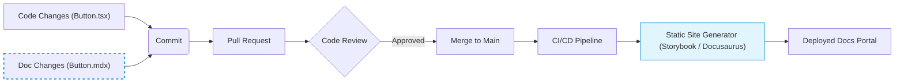

# Documentation as Code (Docs-as-Code)

Documentation as Code — это инженерный подход, при котором документация (к дизайн-системе, архитектуре, API) создается, версионируется и собирается по тем же правилам и инструментам, что и исходный код. Никаких Google Docs, Confluence или разрозненных wiki. Вся документация живет в репозитории, пишется в легковесном формате (Markdown/MDX) и проходит стадию Code Review.

## Какую боль мы решаем?
В традиционном подходе документация быстро устаревает. Код меняется в IDE, а документация лежит где-то на портале, куда разработчику нужно не забыть зайти. В итоге мы получаем рассинхронизацию: документация врет, и ей перестают доверять. 
Перенося документацию "ближе к коду" (часто прямо в соседнюю папку или в сам код), мы снижаем трение при ее обновлении и гарантируем консистентность через CI/CD (например, не сливать PR, пока не обновлен `.md` файл).

## Как это работает на практике
Разработчик описывает компонент дизайн-системы в файле `Button.mdx`, который лежит рядом с `Button.tsx`. В этом файле он может не просто писать текст, но и импортировать сам React-компонент, рендеря его живые примеры. При пуше в `main` ветку, CI/CD запускает генератор статических сайтов (Docusaurus, Storybook, Nextra) и деплоит новую версию документации.



## Антипаттерн vs Правильное решение

❌ **Антипаттерн: Оторванная документация с мертвым кодом**
В Confluence:
```html
<!-- Пример использования кнопки. Никто не знает, компилируется ли этот код сейчас -->
<Button color="blue" isBig={true}>Click me</Button>
```
*Проблема: В последнем релизе `color` заменили на `variant`, а `isBig` на `size`, но в Confluence это не обновили.*

✅ **Правильное решение: MDX и живые компоненты**
В файле `Button.mdx` рядом с кодом:
```mdx
# Button

Кнопка используется для основных действий.

import { Button } from './Button';

<!-- Это живой React-компонент. Если его API сломается, сборка доки упадет в CI! -->
<Button variant="primary" size="large">Живой пример</Button>
```

## Неочевидные нюансы и границы применимости
- **Барьер для нетехнических специалистов:** Менеджерам, аналитикам и даже некоторым дизайнерам может быть сложно освоить Git, Markdown и процесс PR для внесения правок в документацию. Для них Docs-as-Code часто выглядит как избыточное усложнение. Для решения можно прикрутить CMS-прослойки, но это добавляет хрупкости.
- **Встроенные линтеры:** Одно из главных преимуществ подхода — возможность линтить документацию (например, через `markdownlint` или проверять орфографию в CI), что невозможно в стандартных WYSIWYG редакторах.
- **Где ломается:** Подход плохо работает для документов, требующих одновременного совместного редактирования в реальном времени (а-ля Google Docs). Если идет брейншторм, Markdown в Git будет тормозить команду из-за конфликтов слияния.
